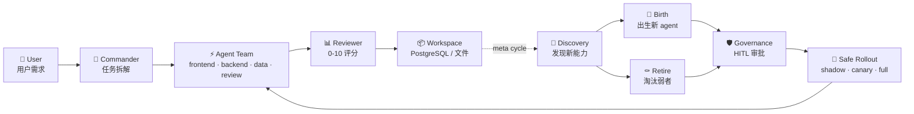
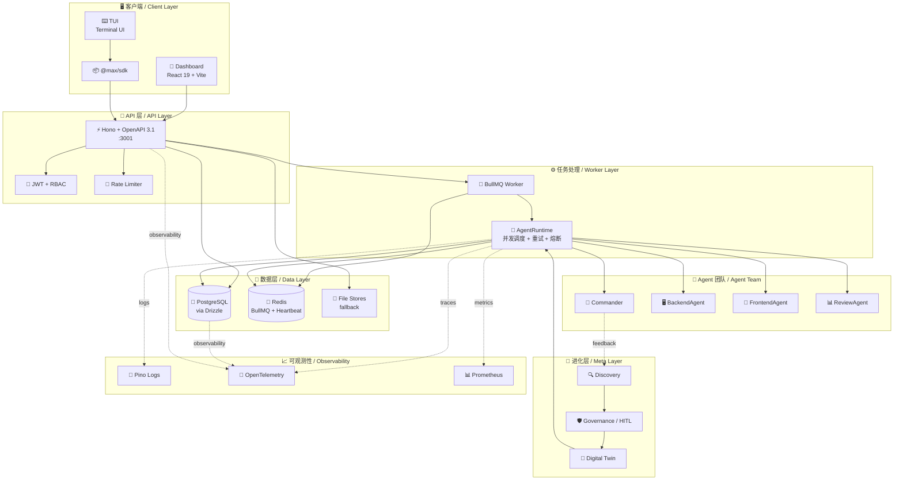

<div align="center">

# ⚡ MAXIMILIAN

### Self-Evolving Multi-Agent OS


<br>

```
███╗   ███╗ █████╗ ██╗  ██╗██╗███╗   ███╗██╗██╗     ██╗ █████╗ ███╗   ██╗
████╗ ████║██╔══██╗╚██╗██╔╝██║████╗ ████║██║██║     ██║██╔══██╗████╗  ██║
██╔████╔██║███████║ ╚███╔╝ ██║██╔████╔██║██║██║     ██║███████║██╔██╗ ██║
██║╚██╔╝██║██╔══██║ ██╔██╗ ██║██║╚██╔╝██║██║██║     ██║██╔══██║██║╚██╗██║
██║ ╚═╝ ██║██║  ██║██╔╝ ██╗██║██║ ╚═╝ ██║██║███████╗██║██║  ██║██║ ╚████║
╚═╝     ╚═╝╚═╝  ╚═╝╚═╝  ╚═╝╚═╝╚═╝     ╚═╝╚═╝╚══════╝╚═╝╚═╝  ╚═╝╚═╝  ╚═══╝
```

<br>

**🇨🇳 一个会自我进化的多智能体操作系统 — 用户提需求,Commander 拆任务,Agent 团队并发执行,Reviewer 打分,Meta-system 观察并进化。**
<br>
**🇺🇸 A self-evolving multi-agent OS — user requests, Commander decomposes, agent team executes in parallel, Reviewer scores, meta-system observes and evolves.**

</div>

---

## 📑 目录 / Table of Contents

- [🌟 这是什么? / What is this?](#-这是什么-what-is-this)
- [✨ 核心特性 / Key Features](#-核心特性-key-features)
- [🚀 5 分钟跑起来 / Quick Start in 5 Minutes](#-5-分钟跑起来-quick-start-in-5-minutes)
- [🏗️ 架构 / Architecture](#-架构-architecture)
- [🧰 技术栈 / Tech Stack](#-技术栈-tech-stack)
- [📁 项目结构 / Project Structure](#-项目结构-project-structure)
- [🔌 API 一览 / API at a Glance](#-api-一览-api-at-a-glance)
- [🔐 认证模式 / Auth Modes](#-认证模式-auth-modes)
- [🌍 平台支持 / Platform Support](#-平台支持-platform-support)
- [📦 部署 / Deployment](#-部署-deployment)
- [📚 文档 / Documentation](#-文档-documentation)
- [🤝 贡献与许可 / Contributing & License](#-贡献与许可-contributing--license)

---

## 🌟 这是什么? / What is this?

<div align="center">



</div>

| 🇨🇳 中文 | 🇺🇸 English |
|---|---|
| 用户输入一个需求,比如"做一个计算器 web app"。**Commander** 把需求拆成多个子任务,**Agent 团队** (前端 / 后端 / 数据 / 审查) 并发执行。**Reviewer** 给结果打分(0-10)。完成后 **Meta-system** 在后台观察,主动发现新能力、出生新 agent、淘汰表现差的,需要时叫人审批(HITL)。 | A user submits a request like "build a calculator web app." The **Commander** decomposes it into tasks. A **team of agents** (frontend, backend, data, review) executes them concurrently. The **Reviewer** scores the output (0-10). Afterward, the **Meta-system** observes in the background — discovering new capabilities, birthing new agents, retiring underperformers, and asking for human approval (HITL) when stakes are high. |

---

## ✨ 核心特性 / Key Features

<div align="center">

| 图标 | 特性 | Icon | Feature |
|:---:|---|:---:|---|
| 🧭 | **Commander** — LLM 驱动的需求拆解 | 🧭 | **Commander** — LLM-driven request decomposition |
| ⚡ | **并发执行** — 多任务并行调度,semaphore 控制 LLM 频率 | ⚡ | **Concurrent execution** — parallel task scheduling with LLM-call semaphore |
| 🤖 | **DAGS 动态组队** — 根据任务自动选 agent 组合 | 🤖 | **DAGS team composition** — dynamic agent team per task |
| 📊 | **Review Agent** — 0-10 分质量评分,反馈学习 | 📊 | **Review Agent** — 0-10 quality scoring + feedback learning |
| 🔁 | **LLM 重试 + 熔断** — 3 次指数退避,5 失败开熔断 | 🔁 | **LLM retry + circuit-breaker** — 3× exponential backoff, 5-fail opens |
| 🔬 | **Meta-system 进化** — 发现 → 出生 / 淘汰 / 拆分 / 合并 | 🔬 | **Meta-system evolution** — discover → birth/retire/split/merge |
| 🛡️ | **Governance HITL** — 高风险动作必走人工审批 | 🛡️ | **Governance HITL** — high-risk actions require human approval |
| 🔄 | **Digital Twin** — 上线前先影子/金丝雀模拟 | 🔄 | **Digital Twin** — shadow/canary simulation before full rollout |
| 🗄️ | **PostgreSQL + 文件双模** — 有 DB 用 PG,无 DB 自动落盘 | 🗄️ | **PostgreSQL + file dual-mode** — PG with `DATABASE_URL`, else file fallback |
| 📨 | **BullMQ 任务队列** — API 接收,Worker 执行,可水平扩 | 📨 | **BullMQ task queue** — API enqueues, Worker executes, horizontal scale |
| 🧪 | **970+ 测试** — 24 包覆盖,Vitest + CI 跑 PG 真实库 | 🧪 | **970+ tests** — 24 packages, Vitest + CI runs against real Postgres |
| 📈 | **可观测性** — Pino + OpenTelemetry + Prometheus | 📈 | **Observability** — Pino + OpenTelemetry + Prometheus |

</div>

---

## 🚀 5 分钟跑起来 / Quick Start in 5 Minutes

<table>
<tr>
<th>🇨🇳 中文步骤</th>
<th>🇺🇸 English Steps</th>
</tr>
<tr>
<td>

**前提**:Node.js 20+,pnpm 9+,至少一个 LLM 的 API key。

```bash
# 1. 装依赖
pnpm install

# 2. 复制环境变量模板
cp .env.example .env

# 3. 填一个 API key 进 .env
#    OPENAI_API_KEY=sk-...
#    或者 ANTHROPIC_API_KEY=sk-ant-...
#    或者 OPENROUTER_API_KEY=sk-or-...

# 4. 启动(开发模式,文件存储)
pnpm dev
```

**访问入口**:
- 🎨 Dashboard: <http://localhost:5174>
- 🔌 API: <http://localhost:3001/api/health>
- 📚 Swagger UI: <http://localhost:3001/api/docs>

</td>
<td>

**Prereqs**: Node.js 20+, pnpm 9+, at least one LLM API key.

```bash
# 1. Install deps
pnpm install

# 2. Copy env template
cp .env.example .env

# 3. Fill in an API key in .env
#    OPENAI_API_KEY=sk-...
#    or ANTHROPIC_API_KEY=sk-ant-...
#    or OPENROUTER_API_KEY=sk-or-...

# 4. Start (dev mode, file storage)
pnpm dev
```

**Access points**:
- 🎨 Dashboard: <http://localhost:5174>
- 🔌 API: <http://localhost:3001/api/health>
- 📚 Swagger UI: <http://localhost:3001/api/docs>

</td>
</tr>
</table>

> 💡 **提示 / Tip**:Docker Compose 一键起全栈(Postgres + API + Worker + Redis + Dashboard):
> ```bash
> docker compose --profile queue --profile observability up -d
> ```
> Docker 把 Dashboard 映射到 **5173**(nginx),`pnpm dev` 是 **5174**(Vite)— 别搞混。

---

## 🏗️ 架构 / Architecture

<div align="center">



</div>

| 🇨🇳 关键点 | 🇺🇸 Key points |
|---|---|
| **API + Worker 分离** — API 接收请求立即返回,真正的执行在 Worker 进程跑,水平扩展只需要加 Worker | **API + Worker split** — API accepts and returns immediately, real work runs in Worker, scale by adding Workers |
| **心跳检测** — Worker 每 15s 写一次 Redis key(TTL 30s),API 入队前先看心跳,没心跳就 503 | **Heartbeat probe** — Worker writes Redis key every 15s (TTL 30s); API checks before enqueue, returns 503 if missing |
| **存储双模** — 有 `DATABASE_URL` 走 PostgreSQL(11 个 PG store),无就走文件系统 | **Dual-mode storage** — with `DATABASE_URL` uses PostgreSQL (11 PG stores); without, falls back to file system |

---

## 🧰 技术栈 / Tech Stack

<div align="center">

| 层 / Layer | 选型 / Choice | 图标 / Icon |
|---|---|:---:|
| **API server** | Hono + OpenAPI 3.1 | ⚡ |
| **Frontend** | React 19 + Vite + Tailwind | 🎨 |
| **Terminal UI** | Ink + React (OpenCode-port) | ⌨️ |
| **Worker** | BullMQ + Redis | 📨 |
| **LLM** | OpenAI · Anthropic · OpenRouter · DeepSeek via `@max/providers` | 🧠 |
| **ORM** | Drizzle (typed schema-as-code) | 🗄️ |
| **Database** | PostgreSQL 16 (file fallback for dev) | 🐘 |
| **Auth** | JWT (jose) + bcryptjs + RBAC | 🔐 |
| **Logging** | Pino (structured JSON) | 📝 |
| **Tracing** | OpenTelemetry + OTLP | 🔭 |
| **Metrics** | Prometheus + Grafana-ready | 📊 |
| **Tests** | Vitest (~970 tests, 24 packages) | 🧪 |
| **CI/CD** | GitHub Actions + Docker multi-stage | 🐳 |
| **Load test** | k6 (nightly) | 📈 |

</div>

---

## 📁 项目结构 / Project Structure

```
Maximilian/
├── 🎯 apps/
│   ├── api/            ⚡ Hono server, OpenAPI 3.1, 86 routes
│   ├── dashboard/      🎨 React 19 + Vite UI
│   ├── tui/            ⌨️ Terminal UI (Ink + React)
│   └── worker/         📨 BullMQ consumer
│
├── 📦 packages/        (21 packages)
│   ├── core/           🧠 Agent runtime, plan/task/result types
│   ├── providers/      🔌 Unified LLM provider + retry + circuit-breaker
│   ├── dags/           🤖 Team graph composition
│   ├── evolution/      📈 Profile store, leaderboard, version snapshots
│   ├── autonomy/       🌀 Execution store, learning API, orchestrator
│   ├── meta-system/    🔬 Discovery + birth/retire + governance
│   ├── agents/         👥 Backend / Frontend / Data / Review impls
│   ├── commander/      🧭 LLM-driven request decomposition
│   ├── llm/            💬 Generation options, presets, tool calls
│   ├── workspace/      📁 File workspace + atomic write helpers
│   ├── database/       🐘 Drizzle schema + 11 PG stores
│   ├── queue/          📨 BullMQ producer/consumer + heartbeat
│   ├── telemetry/      📝 Pino + OTel + Prometheus
│   ├── config/         ⚙️ Zod-validated env + feature flags
│   ├── sdk/            📦 Client SDK for the TUI
│   ├── tools/          🛠️ bash / read / grep / edit / glob
│   ├── i18n/           🌐 Locale catalog + plural rules
│   ├── ui-react/       🧩 React component primitives
│   ├── ui-state/       🗃️ Cross-component state store
│   ├── compat-shims/   ↩️ Backwards-compat re-exports
│   └── benchmark-core/ 📊 Benchmark harness
│
├── 📚 docs/
│   ├── architecture/   🏗️ Design docs
│   ├── operations/     🚀 Deployment runbooks
│   ├── changelogs/     📜 Per-phase detail
│   └── ...
│
├── 🐳 deploy/          ☸️ K8s manifests
├── 🛠️ scripts/         🪛 bootstrap / migrate / smoke / launchers
├── .github/workflows/  🟢 ci.yml + deploy.yml + load.yml + upgrade-check.yml
├── docker-compose.yml  🐘 Full stack: PG + Redis + API + Worker + Dashboard + OTel + Prom
├── SECURITY.md         🔒 Vulnerability disclosure
└── README.md           📖 You are here
```

---

## 🔌 API 一览 / API at a Glance

| 标签 / Tag | 路径前缀 / Path prefix | 用途 / Purpose |
|---|---|---|
| 🔐 `auth` | `/api/auth/*` | 注册 / 登录 / 刷新 / 登出 (JWT) |
| 💬 `chat` | `/api/chat` | 提交需求,触发 workspace |
| 📦 `workspaces` | `/api/workspaces/*` | CRUD + 列表 / 详情 / 产物 |
| 🌀 `executions` | `/api/executions/*` | 执行历史、回放、产物下载 |
| 🧠 `learning` | `/api/learning/*` | Agent 表现学习数据 |
| 📈 `evolution` | `/api/evolution/*` | 画像 / 排行榜 / 版本快照 |
| 🔬 `meta` | `/api/meta/*` | 进化 / 发现 / 治理 / 出生 / 淘汰 |
| 🛡️ `governance` | `/api/governance/*` | 风险评估 / 审批 / 策略 |
| 🏢 `tenants` | `/api/tenants/*` | 租户 CRUD(多租户模式) |
| 👥 `permissions` | `/api/permissions/*` | RBAC 权限矩阵 |
| 📊 `usage` | `/api/usage/*` | LLM token 用量、计费 |
| 📈 `observability` | `/api/observability/*` | 指标 / 事件 / 健康检查 |
| ⚙️ `system` | `/api/health`, `/api/metrics`, `/api/ready` | 健康 / Prometheus / K8s 就绪 |

> **共 86 个路由,分 13 个 tag 组**。完整 OpenAPI 3.1 spec 在运行时通过 <http://localhost:3001/api/openapi.json> 拉取,Swagger UI 在 <http://localhost:3001/api/docs>。

---

## 🔐 认证模式 / Auth Modes

<div align="center">

```
🟢 Dev (no auth)        🟡 Single-tenant         🟠 Multi-user         🔴 Production
─────────────────       ──────────────────       ──────────────────    ──────────────────
No JWT_SECRET            Set ADMIN_TOKEN=…        Set JWT_SECRET=…      NODE_ENV=production
No ADMIN_TOKEN           Authorization:           + DATABASE_URL=…      requires auth
                         Bearer <token>           + /api/auth/register  
                                                 + /api/auth/login  
                                                 + RBAC: admin /       
                                                   operator / viewer
```

</div>

| 模式 / Mode | 配置 / Config | 鉴权方式 / Auth | 适用场景 / Use case |
|---|---|---|---|
| 🟢 **Dev** | 啥都不设 | 无 auth,所有端点放行 | 本地玩,别联网 |
| 🟡 **Single-tenant** | `ADMIN_TOKEN=xxx` | `Authorization: Bearer xxx` | 一个人/小团队自托管 |
| 🟠 **Multi-user** | `JWT_SECRET=…` + `DATABASE_URL=…` | 注册拿 JWT,RBAC 三角色 | 多人协作、SaaS |
| 🔴 **Production** | 上面任一 + `NODE_ENV=production` | 同上,但 server 启动时强制要求 | 上线 |

---

## 🌍 平台支持 / Platform Support

<div align="center">

|  | 🐧 Linux | 🍎 macOS | 🪟 Windows 11 |
|:---:|:---:|:---:|:---:|
| ⚡ **API** | ✅ OK | ✅ OK | ✅ OK |
| 🎨 **Dashboard** | ✅ OK | ✅ OK | ✅ OK |
| ⌨️ **TUI** | ✅ OK | ✅ OK | ✅ OK¹ |
| 📨 **Worker** | ✅ OK | ✅ OK | ✅ OK |
| 🐳 **Docker** | ✅ OK | ✅ OK | ✅ OK |

</div>

¹ TUI 在 Windows 11 上需要 **Windows Terminal 1.18+** 或 **PowerShell 7+**(为了 ANSI 颜色、emoji、box-drawing)。老的 `conhost` (cmd.exe) 会降级到 ASCII。启动器 `scripts/maximilian.cmd` 是 Windows 推荐入口。

---

## 📦 部署 / Deployment

### 🎛️ Feature flags

| Flag | 默认 / Default | 效果 / Effect |
|---|---|---|
| `EVOLUTION_ENABLED` | `true` | 画像 + 排行榜 + 自动晋升 |
| `DAGS_MODE` | `false` | 走 DAGS 团队组合(跳过 Commander) |
| `META_AGENT_ENABLED` | `false` | Discovery + 出生 / 淘汰 + 治理周期 |
| `DIGITAL_TWIN_ENABLED` | `false` | 模拟 → 安全上线(需要先开 meta) |
| `TELEMETRY_ENABLED` | `true` | TelemetryCollector + Prometheus |
| `TASK_QUEUE_ENABLED` | `false` | 走 BullMQ 队列(否则进程内执行) |
| `MULTI_TENANT_ENABLED` | `false` | 每个 store 强制租户隔离 |

### 🐳 全栈一键起 / Full-stack with Docker

```bash
docker compose --profile queue --profile observability up -d
```

启动的服务 / Services started:
- 🐘 **postgres** — `localhost:5432`
- 🔴 **redis** — `localhost:6379`
- ⚡ **api** — `localhost:3001`
- 🎨 **dashboard** — `localhost:5173` (nginx)
- 📨 **worker** — 内连,无对外端口
- 🔭 **otel-collector** — `localhost:4317` (gRPC) / `4318` (HTTP)
- 📊 **prometheus** — `localhost:9090`

完整部署手册 / Full deployment runbook:[`docs/operations/deployment.md`](docs/operations/deployment.md)

里面包括 / including:
- 🏠 自托管 (Docker Compose / Kubernetes)
- 🔑 生成生产 `JWT_SECRET`
- 🗃️ 初次数据库迁移
- 👤 第一个 admin 用户
- 📈 Worker 水平扩
- 📊 Prometheus / Grafana
- 🔭 OpenTelemetry collector
- 💾 备份 & 恢复
- 🆘 Troubleshooting

---

## 🧪 跑测试 / Running Tests

```bash
pnpm test                       # 全部 970+ tests
pnpm --filter @max/api test     # 只跑 API(170 tests)
pnpm type-check                 # 只跑 TS 类型检查
pnpm lint                       # 只跑 lint
```

CI 在每次 push 到 main 跑全套,并启一个 PostgreSQL service container 让 DB 相关测试跑在真 PG 上。

---

## 📚 文档 / Documentation

| 文档 / Doc | 路径 / Path | 用途 / What |
|---|---|---|
| 🚀 部署手册 | [`docs/operations/deployment.md`](docs/operations/deployment.md) | 生产部署完整流程 |
| 🏗️ 架构 | [`docs/architecture/`](docs/architecture/) | 系统模块依赖、设计权衡 |
| 📜 变更日志 | [`docs/changelogs/`](docs/changelogs/) | 6 个 phase 的逐项改动 |
| 🤖 Agent 设计 | [`docs/agent-designs/`](docs/agent-designs/) | 各类 agent 的 prompt / schema |
| 🔬 Meta-system | [`docs/meta-system/`](docs/meta-system/) | 进化 / 治理 / HITL 详细 |
| 🛡️ 安全 | [`SECURITY.md`](SECURITY.md) | 漏洞披露策略 |

---

## 🤝 贡献与许可 / Contributing & License

<div align="center">

```
┌──────────────────────────────────────────────────────────────┐
│  🐛 Found a bug?  →  Open an issue with logs + repro steps   │
│  💡 Have an idea? →  Open a discussion first                 │
│  🔧 Want to PR?   →  Fork → branch → tests → PR             │
│  🔒 Security?     →  See SECURITY.md (do NOT open public)    │
└──────────────────────────────────────────────────────────────┘
```

**🐛 发现 bug?** 开 issue 附上日志和复现步骤
**💡 有想法?** 先开 discussion 聊聊
**🔧 想 PR?** Fork → 分支 → 写测试 → 提 PR
**🔒 安全问题?** 看 [SECURITY.md](SECURITY.md),**不要**公开提

**📜 License**:TBD(待定 — 商用 OSS,具体条款由 owner 定)

---

<sub align="center">
Built with ❤️ by syxscott · Powered by 21 packages · 4 apps · ~970 tests<br>
<sub>Meta-agent OS · 2026</sub>
</sub>
