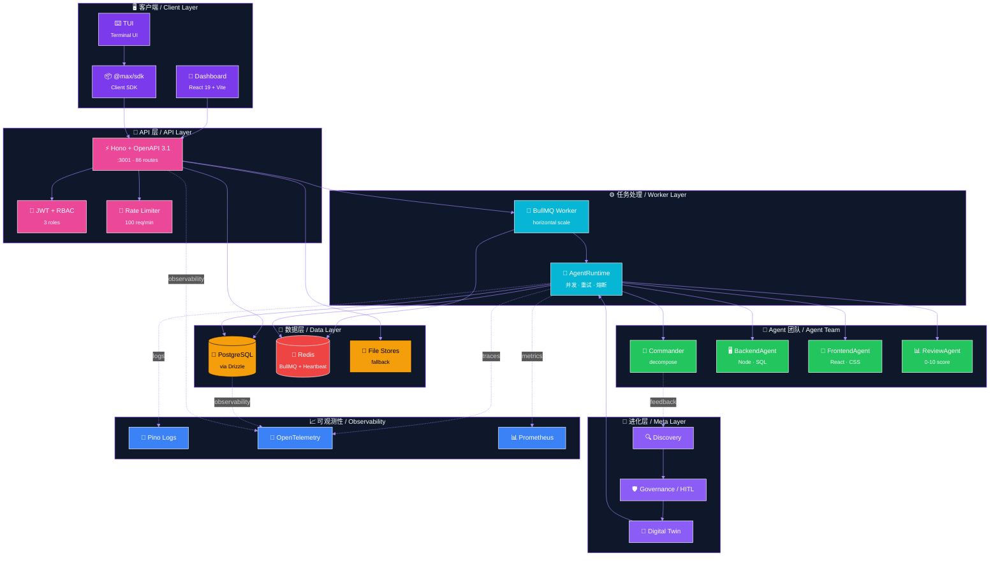

<div align="center">

<!-- ============== ASCII HERO (original style) ============== -->

```
███╗   ███╗ █████╗ ██╗  ██╗██╗███╗   ███╗██╗██╗     ██╗ █████╗ ███╗   ██╗
████╗ ████║██╔══██╗╚██╗██╔╝██║████╗ ████║██║██║     ██║██╔══██╗████╗  ██║
██╔████╔██║███████║ ╚███╔╝ ██║██╔████╔██║██║██║     ██║███████║██╔██╗ ██║
██║╚██╔╝██║██╔══██║ ██╔██╗ ██║██║╚██╔╝██║██║██║     ██║██╔══██║██║╚██╗██║
██║ ╚═╝ ██║██║  ██║██╔╝ ██╗██║██║ ╚═╝ ██║██║███████╗██║██║  ██║██║ ╚████║
╚═╝     ╚═╝╚═╝  ╚═╝╚═╝  ╚═╝╚═╝╚═╝     ╚═╝╚═╝╚══════╝╚═╝╚═╝  ╚═╝╚═╝  ╚═══╝
```

<br>

<h2>
  
</h2>

<!-- ============== ANIMATED BADGES ============== -->
<p>
  
  
  
  <br>
  
  
  
  
</p>

<!-- ============== STATUS PILLS ============== -->
<p>
  <a href="#-5-分钟跑起来-quick-start-in-5-minutes"></a>
  <a href="#-架构-architecture"></a>
  <a href="#-部署-deployment"></a>
  <a href="#-文档-documentation"></a>
</p>

<br>

<!-- ============== TYPING EFFECT TAGLINE ============== -->

```diff
! 用户提需求 ─→ Commander 拆任务 ─→ Agent 团队并发执行 ─→ Reviewer 打分 ─→ Meta-system 进化
! User requests ─→ Commander decomposes ─→ Agent team parallel ─→ Reviewer scores ─→ Meta-system evolves
```

</div>

---

<!-- ============== WAVE DIVIDER ============== -->
<p align="center">
  <svg width="100%" height="60" viewBox="0 0 1200 60" xmlns="http://www.w3.org/2000/svg" preserveAspectRatio="none">
    <path d="M0,30 Q300,5 600,30 T1200,30 L1200,60 L0,60 Z" fill="url(#heroGrad)" opacity="0.4">
      <animate attributeName="d" dur="6s" repeatCount="indefinite"
        values="M0,30 Q300,5 600,30 T1200,30 L1200,60 L0,60 Z;
                M0,30 Q300,55 600,30 T1200,30 L1200,60 L0,60 Z;
                M0,30 Q300,5 600,30 T1200,30 L1200,60 L0,60 Z"/>
    </path>
  </svg>
</p>

## 📑 目录 / Table of Contents

| 🇨🇳 中文 | 🇺🇸 English |
|---|---|
| 🌟 [这是什么?](#-这是什么-what-is-this) | [What is this?](#-这是什么-what-is-this) |
| 📊 [项目数据](#-项目数据-by-the-numbers) | [By the numbers](#-项目数据-by-the-numbers) |
| ✨ [核心特性](#-核心特性-key-features) | [Key Features](#-核心特性-key-features) |
| 🚀 [5 分钟跑起来](#-5-分钟跑起来-quick-start-in-5-minutes) | [Quick Start in 5 Minutes](#-5-分钟跑起来-quick-start-in-5-minutes) |
| 🏗️ [架构](#-架构-architecture) | [Architecture](#-架构-architecture) |
| 🧰 [技术栈](#-技术栈-tech-stack) | [Tech Stack](#-技术栈-tech-stack) |
| 📁 [项目结构](#-项目结构-project-structure) | [Project Structure](#-项目结构-project-structure) |
| 🔌 [API 一览](#-api-一览-api-at-a-glance) | [API at a Glance](#-api-一览-api-at-a-glance) |
| 🔐 [认证模式](#-认证模式-auth-modes) | [Auth Modes](#-认证模式-auth-modes) |
| 🌍 [平台支持](#-平台支持-platform-support) | [Platform Support](#-平台支持-platform-support) |
| 📦 [部署](#-部署-deployment) | [Deployment](#-部署-deployment) |
| 🧪 [跑测试](#-跑测试-running-tests) | [Running Tests](#-跑测试-running-tests) |
| 📚 [文档](#-文档-documentation) | [Documentation](#-文档-documentation) |
| 🙏 [致谢与借鉴](#-致谢与借鉴-acknowledgements) | [Acknowledgements](#-致谢与借鉴-acknowledgements) |
| 🤝 [贡献与许可](#-贡献与许可-contributing--license) | [Contributing & License](#-贡献与许可-contributing--license) |

---

## 🌟 这是什么? / What is this?

```mermaid
%%{init: {'theme':'dark', 'themeVariables': {'primaryColor':'#7c3aed','primaryTextColor':'#fff','primaryBorderColor':'#7c3aed','lineColor':'#ec4899','secondaryColor':'#1f2937','tertiaryColor':'#06b6d4'}}}%%
flowchart LR
    A[👤 User<br/>用户需求] --> B[🧭 Commander<br/>任务拆解]
    B --> C[⚡ Agent Team<br/>frontend · backend<br/>data · review]
    C --> D[📊 Reviewer<br/>0-10 评分]
    D --> E[📦 Workspace<br/>PostgreSQL + 文件]
    E -.meta cycle.-> F[🔬 Discovery<br/>发现新能力]
    F --> G[👶 Birth<br/>出生新 agent]
    F --> H[⚰️ Retire<br/>淘汰弱者]
    G --> I[🛡️ Governance<br/>HITL 审批]
    H --> I
    I --> J[🚀 Safe Rollout<br/>shadow · canary · full]
    J --> C

    style A fill:#7c3aed,stroke:#fff,stroke-width:2px,color:#fff
    style B fill:#ec4899,stroke:#fff,stroke-width:2px,color:#fff
    style C fill:#06b6d4,stroke:#fff,stroke-width:2px,color:#fff
    style D fill:#22c55e,stroke:#fff,stroke-width:2px,color:#fff
    style E fill:#f59e0b,stroke:#fff,stroke-width:2px,color:#000
    style F fill:#8b5cf6,stroke:#fff,stroke-width:2px,color:#fff
    style G fill:#10b981,stroke:#fff,stroke-width:2px,color:#fff
    style H fill:#ef4444,stroke:#fff,stroke-width:2px,color:#fff
    style I fill:#3b82f6,stroke:#fff,stroke-width:2px,color:#fff
    style J fill:#14b8a6,stroke:#fff,stroke-width:2px,color:#fff
```

<div align="center">



</div>

<table>
<tr>
<th>🇨🇳 中文</th>
<th>🇺🇸 English</th>
</tr>
<tr>
<td width="50%" valign="top">

用户输入一个需求,比如"做一个计算器 web app"。**Commander** 把需求拆成多个子任务,**Agent 团队** (前端 / 后端 / 数据 / 审查) 并发执行。**Reviewer** 给结果打分(0-10)。

完成后 **Meta-system** 在后台观察,主动发现新能力、出生新 agent、淘汰表现差的,需要时叫人审批(HITL)。

</td>
<td width="50%" valign="top">

A user submits a request like "build a calculator web app." The **Commander** decomposes it into tasks. A **team of agents** (frontend, backend, data, review) executes them concurrently. The **Reviewer** scores the output (0-10).

Afterward, the **Meta-system** observes in the background — discovering new capabilities, birthing new agents, retiring underperformers, and asking for human approval (HITL) when stakes are high.

</td>
</tr>
</table>

---

## 📊 项目数据 / By the numbers

<div align="center">

<table>
<tr>
<td align="center" width="14%">
<svg width="100" height="100" viewBox="0 0 100 100">
  <circle cx="50" cy="50" r="45" fill="none" stroke="#1f2937" stroke-width="6"/>
  <circle cx="50" cy="50" r="45" fill="none" stroke="#7c3aed" stroke-width="6"
          stroke-dasharray="283" stroke-dashoffset="14" transform="rotate(-90 50 50)" stroke-linecap="round"/>
  <text x="50" y="55" text-anchor="middle" font-size="20" font-weight="900" fill="#7c3aed">1283</text>
</svg>
<br><b>1283 Tests</b>
<br><sub>✅ 全部通过 / all green</sub>
</td>
<td align="center" width="14%">
<svg width="100" height="100" viewBox="0 0 100 100">
  <circle cx="50" cy="50" r="45" fill="none" stroke="#1f2937" stroke-width="6"/>
  <circle cx="50" cy="50" r="45" fill="none" stroke="#ec4899" stroke-width="6"
          stroke-dasharray="283" stroke-dashoffset="0" transform="rotate(-90 50 50)" stroke-linecap="round"/>
  <text x="50" y="48" text-anchor="middle" font-size="20" font-weight="900" fill="#ec4899">21</text>
  <text x="50" y="64" text-anchor="middle" font-size="9" fill="#ec4899">+4 apps</text>
</svg>
<br><b>21 + 4</b>
<br><sub>📦 包 + 应用 / packages + apps</sub>
</td>
<td align="center" width="14%">
<svg width="100" height="100" viewBox="0 0 100 100">
  <circle cx="50" cy="50" r="45" fill="none" stroke="#1f2937" stroke-width="6"/>
  <circle cx="50" cy="50" r="45" fill="none" stroke="#06b6d4" stroke-width="6"
          stroke-dasharray="283" stroke-dashoffset="28" transform="rotate(-90 50 50)" stroke-linecap="round"/>
  <text x="50" y="55" text-anchor="middle" font-size="20" font-weight="900" fill="#06b6d4">86</text>
</svg>
<br><b>86 Routes</b>
<br><sub>🔌 HTTP API 路由</sub>
</td>
<td align="center" width="14%">
<svg width="100" height="100" viewBox="0 0 100 100">
  <circle cx="50" cy="50" r="45" fill="none" stroke="#1f2937" stroke-width="6"/>
  <circle cx="50" cy="50" r="45" fill="none" stroke="#22c55e" stroke-width="6"
          stroke-dasharray="283" stroke-dashoffset="85" transform="rotate(-90 50 50)" stroke-linecap="round"/>
  <text x="50" y="55" text-anchor="middle" font-size="20" font-weight="900" fill="#22c55e">6</text>
</svg>
<br><b>6 Phases</b>
<br><sub>📜 完整开发阶段</sub>
</td>
<td align="center" width="14%">
<svg width="100" height="100" viewBox="0 0 100 100">
  <circle cx="50" cy="50" r="45" fill="none" stroke="#1f2937" stroke-width="6"/>
  <circle cx="50" cy="50" r="45" fill="none" stroke="#f59e0b" stroke-width="6"
          stroke-dasharray="283" stroke-dashoffset="0" transform="rotate(-90 50 50)" stroke-linecap="round"/>
  <text x="50" y="48" text-anchor="middle" font-size="20" font-weight="900" fill="#f59e0b">3</text>
  <text x="50" y="64" text-anchor="middle" font-size="9" fill="#f59e0b">DAGS</text>
</svg>
<br><b>DAGS Mode</b>
<br><sub>🤖 动态组队</sub>
</td>
<td align="center" width="14%">
<svg width="100" height="100" viewBox="0 0 100 100">
  <circle cx="50" cy="50" r="45" fill="none" stroke="#1f2937" stroke-width="6"/>
  <circle cx="50" cy="50" r="45" fill="none" stroke="#3b82f6" stroke-width="6"
          stroke-dasharray="283" stroke-dashoffset="0" transform="rotate(-90 50 50)" stroke-linecap="round"/>
  <text x="50" y="48" text-anchor="middle" font-size="18" font-weight="900" fill="#3b82f6">PG+FS</text>
<text x="50" y="64" text-anchor="middle" font-size="9" fill="#3b82f6">dual</text>
</svg>
<br><b>PG + FS</b>
<br><sub>🗄️ 双模存储</sub>
</td>
<td align="center" width="14%">
<svg width="100" height="100" viewBox="0 0 100 100">
  <circle cx="50" cy="50" r="45" fill="none" stroke="#1f2937" stroke-width="6"/>
  <circle cx="50" cy="50" r="45" fill="none" stroke="#10b981" stroke-width="6"
          stroke-dasharray="283" stroke-dashoffset="0" transform="rotate(-90 50 50)" stroke-linecap="round"/>
  <text x="50" y="55" text-anchor="middle" font-size="20" font-weight="900" fill="#10b981">7</text>
</svg>
<br><b>7 Flags</b>
<br><sub>🎛️ 可配置特性</sub>
</td>
</tr>
</table>

</div>

---

## ✨ 核心特性 / Key Features

<div align="center">

<table>
<tr>
<th width="6%">🎨</th>
<th width="44%">🇨🇳 中文</th>
<th width="6%">🎨</th>
<th width="44%">🇺🇸 English</th>
</tr>
<tr>
<td align="center">🧭</td>
<td><b>Commander</b> — LLM 驱动的需求拆解</td>
<td align="center">🧭</td>
<td><b>Commander</b> — LLM-driven request decomposition</td>
</tr>
<tr>
<td align="center">⚡</td>
<td><b>并发执行</b> — 多任务并行调度,semaphore 控制 LLM 频率</td>
<td align="center">⚡</td>
<td><b>Concurrent execution</b> — parallel task scheduling with LLM-call semaphore</td>
</tr>
<tr>
<td align="center">🤖</td>
<td><b>DAGS 动态组队</b> — 根据任务自动选 agent 组合</td>
<td align="center">🤖</td>
<td><b>DAGS team composition</b> — dynamic agent team per task</td>
</tr>
<tr>
<td align="center">📊</td>
<td><b>Review Agent</b> — 0-10 分质量评分,反馈学习</td>
<td align="center">📊</td>
<td><b>Review Agent</b> — 0-10 quality scoring + feedback learning</td>
</tr>
<tr>
<td align="center">🔁</td>
<td><b>LLM 重试 + 熔断</b> — 3× 指数退避,5 失败开熔断</td>
<td align="center">🔁</td>
<td><b>LLM retry + circuit-breaker</b> — 3× exponential backoff, 5-fail opens</td>
</tr>
<tr>
<td align="center">🔬</td>
<td><b>Meta-system 进化</b> — 发现 → 出生 / 淘汰 / 拆分 / 合并</td>
<td align="center">🔬</td>
<td><b>Meta-system evolution</b> — discover → birth/retire/split/merge</td>
</tr>
<tr>
<td align="center">🛡️</td>
<td><b>Governance HITL</b> — 高风险动作必走人工审批</td>
<td align="center">🛡️</td>
<td><b>Governance HITL</b> — high-risk actions require human approval</td>
</tr>
<tr>
<td align="center">🔄</td>
<td><b>Digital Twin</b> — 上线前先影子/金丝雀模拟</td>
<td align="center">🔄</td>
<td><b>Digital Twin</b> — shadow/canary simulation before full rollout</td>
</tr>
<tr>
<td align="center">🗄️</td>
<td><b>PostgreSQL + 文件双模</b> — 有 DB 用 PG,无 DB 自动落盘</td>
<td align="center">🗄️</td>
<td><b>PostgreSQL + file dual-mode</b> — PG with <code>DATABASE_URL</code>, else file fallback</td>
</tr>
<tr>
<td align="center">📨</td>
<td><b>BullMQ 任务队列</b> — API 接收,Worker 执行,可水平扩</td>
<td align="center">📨</td>
<td><b>BullMQ task queue</b> — API enqueues, Worker executes, horizontal scale</td>
</tr>
<tr>
<td align="center">🧪</td>
<td><b>1283+ 测试</b> — 21 包 + 4 app 覆盖,Vitest + CI 跑 PG 真实库</td>
<td align="center">🧪</td>
<td><b>1283+ tests</b> — 21 packages + 4 apps, Vitest + CI runs against real Postgres</td>
</tr>
<tr>
<td align="center">📈</td>
<td><b>可观测性</b> — Pino + OpenTelemetry + Prometheus</td>
<td align="center">📈</td>
<td><b>Observability</b> — Pino + OpenTelemetry + Prometheus</td>
</tr>
</table>

</div>

---

<!-- ============== WAVE DIVIDER ============== -->
<p align="center">
  <svg width="100%" height="40" viewBox="0 0 1200 40" xmlns="http://www.w3.org/2000/svg" preserveAspectRatio="none">
    <path d="M0,20 Q200,5 400,20 T800,20 T1200,20" stroke="#7c3aed" stroke-width="2" fill="none" opacity="0.5">
      <animate attributeName="stroke-dasharray" values="0,2000;2000,0" dur="4s" repeatCount="indefinite"/>
    </path>
  </svg>
</p>

## 🚀 5 分钟跑起来 / Quick Start in 5 Minutes

<table>
<tr>
<th width="50%">🇨🇳 中文步骤</th>
<th width="50%">🇺🇸 English Steps</th>
</tr>
<tr>
<td valign="top">

**前提**:Node.js 20+,pnpm 9+,至少一个 LLM 的 API key。

```bash
# 1. 装依赖
pnpm install

# 2. 复制环境变量模板
cp .env.example .env

# 3. 填一个 API key 进 .env
#    OPENAI_API_KEY=sk-...
#    或者 ANTHROPIC_API_KEY=sk-ant-...
#    或者 OPENROUTER_API_KEY=sk-or-...

# 4. 启动(开发模式,文件存储)
pnpm dev
```

**访问入口**:
- 🎨 Dashboard: <http://localhost:5174>
- 🔌 API: <http://localhost:3001/api/health>
- 📚 Swagger UI: <http://localhost:3001/api/docs>

</td>
<td valign="top">

**Prereqs**: Node.js 20+, pnpm 9+, at least one LLM API key.

```bash
# 1. Install deps
pnpm install

# 2. Copy env template
cp .env.example .env

# 3. Fill in an API key in .env
#    OPENAI_API_KEY=sk-...
#    or ANTHROPIC_API_KEY=sk-ant-...
#    or OPENROUTER_API_KEY=sk-or-...

# 4. Start (dev mode, file storage)
pnpm dev
```

**Access points**:
- 🎨 Dashboard: <http://localhost:5174>
- 🔌 API: <http://localhost:3001/api/health>
- 📚 Swagger UI: <http://localhost:3001/api/docs>

</td>
</tr>
</table>

> 💡 **提示 / Tip**:Docker Compose 一键起全栈(Postgres + API + Worker + Redis + Dashboard):
> ```bash
> docker compose --profile queue --profile observability up -d
> ```
> Docker 把 Dashboard 映射到 **5173**(nginx),`pnpm dev` 是 **5174**(Vite)— 别搞混。

---

## 🏗️ 架构 / Architecture

<div align="center">



</div>

<table>
<tr>
<th>🇨🇳 关键点</th>
<th>🇺🇸 Key points</th>
</tr>
<tr>
<td valign="top">

- **API + Worker 分离** — API 接收请求立即返回,真正的执行在 Worker 进程跑,水平扩展只需要加 Worker
- **心跳检测** — Worker 每 15s 写一次 Redis key(TTL 30s),API 入队前先看心跳,没心跳就 503
- **存储双模** — 有 `DATABASE_URL` 走 PostgreSQL(11 个 PG store),无就走文件系统

</td>
<td valign="top">

- **API + Worker split** — API accepts and returns immediately, real work runs in Worker, scale by adding Workers
- **Heartbeat probe** — Worker writes Redis key every 15s (TTL 30s); API checks before enqueue, returns 503 if missing
- **Dual-mode storage** — with `DATABASE_URL` uses PostgreSQL (11 PG stores); without, falls back to file system

</td>
</tr>
</table>

---

## 🧰 技术栈 / Tech Stack

<div align="center">

<table>
<tr>
<th>层 / Layer</th>
<th>选型 / Choice</th>
<th width="5%">图标 / Icon</th>
</tr>
<tr><td><b>API server</b></td><td>Hono + OpenAPI 3.1</td><td align="center">⚡</td></tr>
<tr><td><b>Frontend</b></td><td>React 19 + Vite + Tailwind</td><td align="center">🎨</td></tr>
<tr><td><b>Terminal UI</b></td><td>Ink + React (OpenCode-port)</td><td align="center">⌨️</td></tr>
<tr><td><b>Worker</b></td><td>BullMQ + Redis</td><td align="center">📨</td></tr>
<tr><td><b>LLM</b></td><td>OpenAI · Anthropic · OpenRouter · DeepSeek via <code>@max/providers</code></td><td align="center">🧠</td></tr>
<tr><td><b>ORM</b></td><td>Drizzle (typed schema-as-code)</td><td align="center">🗄️</td></tr>
<tr><td><b>Database</b></td><td>PostgreSQL 16 (file fallback for dev)</td><td align="center">🐘</td></tr>
<tr><td><b>Auth</b></td><td>JWT (jose) + bcryptjs + RBAC</td><td align="center">🔐</td></tr>
<tr><td><b>Logging</b></td><td>Pino (structured JSON)</td><td align="center">📝</td></tr>
<tr><td><b>Tracing</b></td><td>OpenTelemetry + OTLP</td><td align="center">🔭</td></tr>
<tr><td><b>Metrics</b></td><td>prom-client + Prometheus</td><td align="center">📊</td></tr>
<tr><td><b>Tests</b></td><td>Vitest (1283 tests, 21 packages + 4 apps)</td><td align="center">🧪</td></tr>
<tr><td><b>CI/CD</b></td><td>GitHub Actions + Docker multi-stage</td><td align="center">🐳</td></tr>
<tr><td><b>Load test</b></td><td>k6 (nightly)</td><td align="center">📈</td></tr>
</table>

</div>

---

## 📁 项目结构 / Project Structure

```
Maximilian/
├── 🎯 apps/
│   ├── api/            ⚡ Hono server, OpenAPI 3.1, 86 routes
│   ├── dashboard/      🎨 React 19 + Vite UI
│   ├── tui/            ⌨️ Terminal UI (Ink + React)
│   └── worker/         📨 BullMQ consumer
│
├── 📦 packages/        (21 packages)
│   ├── core/           🧠 Agent runtime, plan/task/result types
│   ├── providers/      🔌 Unified LLM provider + retry + circuit-breaker
│   ├── dags/           🤖 Team graph composition
│   ├── evolution/      📈 Profile store, leaderboard, version snapshots
│   ├── autonomy/       🌀 Execution store, learning API, orchestrator
│   ├── meta-system/    🔬 Discovery + birth/retire + governance
│   ├── agents/         👥 Backend / Frontend / Data / Review impls
│   ├── commander/      🧭 LLM-driven request decomposition
│   ├── llm/            💬 Generation options, presets, tool calls
│   ├── workspace/      📁 File workspace + atomic write helpers
│   ├── database/       🐘 Drizzle schema + 11 PG stores
│   ├── queue/          📨 BullMQ producer/consumer + heartbeat
│   ├── telemetry/      📝 Pino + OTel + Prometheus
│   ├── config/         ⚙️ Zod-validated env + feature flags
│   ├── sdk/            📦 Client SDK for the TUI
│   ├── tools/          🛠️ bash / read / grep / edit / glob
│   ├── i18n/           🌐 Locale catalog + plural rules
│   ├── ui-react/       🧩 React component primitives
│   ├── ui-state/       🗃️ Cross-component state store
│   ├── compat-shims/   ↩️ Backwards-compat re-exports
│   └── benchmark-core/ 📊 Benchmark harness
│
├── 📚 docs/
│   ├── architecture/   🏗️ Design docs
│   ├── operations/     🚀 Deployment runbooks
│   ├── changelogs/     📜 Per-phase detail
│   └── ...
│
├── 🐳 deploy/          ☸️ K8s manifests
├── 🛠️ scripts/         🪛 bootstrap / migrate / smoke / launchers
├── .github/workflows/  🟢 ci.yml + deploy.yml + load.yml + upgrade-check.yml
├── docker-compose.yml  🐘 Full stack: PG + Redis + API + Worker + Dashboard + OTel + Prom
├── SECURITY.md         🔒 Vulnerability disclosure
└── README.md           📖 You are here
```

---

## 🔌 API 一览 / API at a Glance

<div align="center">

| 标签 / Tag | 路径前缀 / Path prefix | 用途 / Purpose |
|---|---|---|
| 🔐 `auth` | `/api/auth/*` | 注册 / 登录 / 刷新 / 登出 (JWT) |
| 💬 `chat` | `/api/chat` | 提交需求,触发 workspace |
| 📦 `workspaces` | `/api/workspaces/*` | CRUD + 列表 / 详情 / 产物 |
| 🌀 `executions` | `/api/executions/*` | 执行历史、回放、产物下载 |
| 🧠 `learning` | `/api/learning/*` | Agent 表现学习数据 |
| 📈 `evolution` | `/api/evolution/*` | 画像 / 排行榜 / 版本快照 |
| 🔬 `meta` | `/api/meta/*` | 进化 / 发现 / 治理 / 出生 / 淘汰 |
| 🛡️ `governance` | `/api/governance/*` | 风险评估 / 审批 / 策略 |
| 🏢 `tenants` | `/api/tenants/*` | 租户 CRUD(多租户模式) |
| 👥 `permissions` | `/api/permissions/*` | RBAC 权限矩阵 |
| 📊 `usage` | `/api/usage/*` | LLM token 用量、计费 |
| 📈 `observability` | `/api/observability/*` | 指标 / 事件 / 健康检查 |
| ⚙️ `system` | `/api/health`, `/api/metrics`, `/api/ready` | 健康 / Prometheus / K8s 就绪 |

</div>

> **共 86 个路由,分 13 个 tag 组**。完整 OpenAPI 3.1 spec 在运行时通过 <http://localhost:3001/api/openapi.json> 拉取,Swagger UI 在 <http://localhost:3001/api/docs>。

---

## 🔐 认证模式 / Auth Modes

<div align="center">

```
🟢 Dev (no auth)        🟡 Single-tenant         🟠 Multi-user         🔴 Production
─────────────────       ──────────────────       ──────────────────    ──────────────────
No JWT_SECRET            Set ADMIN_TOKEN=…        Set JWT_SECRET=…      NODE_ENV=production
No ADMIN_TOKEN           Authorization:           + DATABASE_URL=…      requires auth
                         Bearer <token>           + /api/auth/register  
                                                 + /api/auth/login  
                                                 + RBAC: admin /       
                                                   operator / viewer
```

</div>

| 模式 / Mode | 配置 / Config | 鉴权方式 / Auth | 适用场景 / Use case |
|---|---|---|---|
| 🟢 **Dev** | 啥都不设 | 无 auth,所有端点放行 | 本地玩,别联网 |
| 🟡 **Single-tenant** | `ADMIN_TOKEN=xxx` | `Authorization: Bearer xxx` | 一个人/小团队自托管 |
| 🟠 **Multi-user** | `JWT_SECRET=…` + `DATABASE_URL=…` | 注册拿 JWT,RBAC 三角色 | 多人协作、SaaS |
| 🔴 **Production** | 上面任一 + `NODE_ENV=production` | 同上,但 server 启动时强制要求 | 上线 |

---

## 🌍 平台支持 / Platform Support

<div align="center">

|  | 🐧 Linux | 🍎 macOS | 🪟 Windows 11 |
|:---:|:---:|:---:|:---:|
| ⚡ **API** | ✅ OK | ✅ OK | ✅ OK |
| 🎨 **Dashboard** | ✅ OK | ✅ OK | ✅ OK |
| ⌨️ **TUI** | ✅ OK | ✅ OK | ✅ OK¹ |
| 📨 **Worker** | ✅ OK | ✅ OK | ✅ OK |
| 🐳 **Docker** | ✅ OK | ✅ OK | ✅ OK |

</div>

¹ TUI 在 Windows 11 上需要 **Windows Terminal 1.18+** 或 **PowerShell 7+**(为了 ANSI 颜色、emoji、box-drawing)。老的 `conhost` (cmd.exe) 会降级到 ASCII。启动器 `scripts/maximilian.cmd` 是 Windows 推荐入口。

---

## 📦 部署 / Deployment

### 🎛️ Feature flags

| Flag | 默认 / Default | 效果 / Effect |
|---|---|---|
| `EVOLUTION_ENABLED` | `true` | 画像 + 排行榜 + 自动晋升 |
| `DAGS_MODE` | `false` | 走 DAGS 团队组合(跳过 Commander) |
| `META_AGENT_ENABLED` | `false` | Discovery + 出生 / 淘汰 + 治理周期 |
| `DIGITAL_TWIN_ENABLED` | `false` | 模拟 → 安全上线(需要先开 meta) |
| `TELEMETRY_ENABLED` | `true` | TelemetryCollector + Prometheus |
| `TASK_QUEUE_ENABLED` | `false` | 走 BullMQ 队列(否则进程内执行) |
| `MULTI_TENANT_ENABLED` | `false` | 每个 store 强制租户隔离 |

### 🐳 全栈一键起 / Full-stack with Docker

```bash
docker compose --profile queue --profile observability up -d
```

启动的服务 / Services started:

<div align="center">

| 服务 / Service | 端口 / Port | 图标 / Icon |
|---|---|:---:|
| 🐘 **postgres** | `localhost:5432` | 🐘 |
| 🔴 **redis** | `localhost:6379` | 🔴 |
| ⚡ **api** | `localhost:3001` | ⚡ |
| 🎨 **dashboard** | `localhost:5173` (nginx) | 🎨 |
| 📨 **worker** | 内连,无对外端口 | 📨 |
| 🔭 **otel-collector** | `localhost:4317` / `4318` | 🔭 |
| 📊 **prometheus** | `localhost:9090` | 📊 |

</div>

完整部署手册 / Full deployment runbook:[`docs/operations/deployment.md`](docs/operations/deployment.md)

里面包括 / including:
- 🏠 自托管 (Docker Compose / Kubernetes)
- 🔑 生成生产 `JWT_SECRET`
- 🗃️ 初次数据库迁移
- 👤 第一个 admin 用户
- 📈 Worker 水平扩
- 📊 Prometheus / Grafana
- 🔭 OpenTelemetry collector
- 💾 备份 & 恢复
- 🆘 Troubleshooting

---

<!-- ============== WAVE DIVIDER ============== -->
<p align="center">
  <svg width="100%" height="40" viewBox="0 0 1200 40" xmlns="http://www.w3.org/2000/svg" preserveAspectRatio="none">
    <path d="M0,20 Q300,5 600,20 T1200,20" stroke="#ec4899" stroke-width="2" fill="none" opacity="0.5">
      <animate attributeName="stroke-dasharray" values="0,2000;2000,0" dur="5s" repeatCount="indefinite"/>
    </path>
  </svg>
</p>

## 🧪 跑测试 / Running Tests

```bash
pnpm test                       # 全部 1283+ tests
pnpm --filter @max/api test     # 只跑 API(170 tests)
pnpm type-check                 # 只跑 TS 类型检查
pnpm lint                       # 只跑 lint
```

CI 在每次 push 到 main 跑全套,并启一个 PostgreSQL service container 让 DB 相关测试跑在真 PG 上。

---

## 📚 文档 / Documentation

| 文档 / Doc | 路径 / Path | 用途 / What |
|---|---|---|
| 🚀 部署手册 | [`docs/operations/deployment.md`](docs/operations/deployment.md) | 生产部署完整流程 |
| 🏗️ 架构 | [`docs/architecture/`](docs/architecture/) | 系统模块依赖、设计权衡 |
| 📜 变更日志 | [`docs/changelogs/`](docs/changelogs/) | 6 个 phase 的逐项改动 |
| 🤖 Agent 设计 | [`docs/agent-designs/`](docs/agent-designs/) | 各类 agent 的 prompt / schema |
| 🔬 Meta-system | [`docs/meta-system/`](docs/meta-system/) | 进化 / 治理 / HITL 详细 |
| 🛡️ 安全 | [`SECURITY.md`](SECURITY.md) | 漏洞披露策略 |

---

## 🙏 致谢与借鉴 / Acknowledgements

<div align="center">

> Maximilian 不是从零造轮子 — 核心模块大量借鉴了开源社区的优秀项目。
> Not built from scratch — Maximilian borrows heavily from outstanding open-source projects.

</div>

Maximilian 在 6 个开发 phase + 4 个 Kosmos wave 中,共 **借鉴 / 改编 (borrow / adapt) 了 30 个模块 / 模式**,源自 11 个开源项目。
每一个借鉴模块都在源码头部标注 `借鉴 <project>` 注释,便于追溯。

下面按 **来源项目** 列出所有借鉴内容。每一项注明:**借鉴模块** → **本仓位置**。

### 🌌 [Kosmos](https://github.com/jimmc414/Kosmos) — 15 patterns (4 waves)

> jimmc414 的多 agent 科研自动化系统,基于 Claude 的科学发现流水线。我们从中扫描并借鉴了 15 个最匹配 Maximilian 的模式。

| 借鉴模块 (Borrowed) | 本仓位置 (In this repo) | 原始文件 (Origin) |
|---|---|---|
| ScholarEval — 8-dim peer-review scoring | `packages/core/src/validation/scholar-eval.ts` | `kosmos/validation/scholar_eval.py` |
| FailureDetector — over-interpretation / invented-metrics / rabbit-hole | `packages/core/src/validation/failure-detector.ts` | `kosmos/validation/failure_detector.py` |
| EventBus — typed pub/sub + EventFilter | `packages/core/src/event-bus.ts` | `kosmos/core/event_bus.py` |
| NullModel — permutation-test validator | `packages/core/src/validation/null-model.ts` | `kosmos/validation/null_model.py` |
| PlanReviewer — 5-dim plan quality gate | `packages/core/src/validation/plan-reviewer.ts` | `kosmos/orchestration/plan_reviewer.py` |
| DelegationManager — concurrent task executor | `packages/core/src/orchestration/delegation-manager.ts` | `kosmos/orchestration/delegation.py` |
| AgentRegistry — type-keyed registry + message routing | `packages/core/src/orchestration/agent-registry.ts` | `kosmos/agents/registry.py` |
| NoveltyDetector — semantic dedup via similarity | `packages/core/src/orchestration/novelty-detector.ts` | `kosmos/orchestration/novelty_detector.py` |
| SafetyGuardrails — code/path/resource policies + emergency stop | `packages/core/src/safety/guardrails.ts` | `kosmos/safety/guardrails.py` |
| ReproducibilityManager — seed + env snapshot + hash | `packages/core/src/safety/reproducibility.ts` | `kosmos/safety/reproducibility.py` |
| KnowledgeGraph — node/edge graph (downgraded from Neo4j) | `packages/core/src/knowledge/graph.ts` | `kosmos/knowledge/graph.py` |
| ArtifactStateManager — JSON finding/hypothesis persistence | `packages/core/src/world-model/artifacts.ts` | `kosmos/world_model/artifacts.py` |
| MetricsCollector — counters + USD budget + alerts | `packages/core/src/monitoring/metrics.ts` | `kosmos/core/metrics.py` |
| HypothesisGenerator — structured hypothesis + scoring | `packages/core/src/agents/hypothesis-generator.ts` | `kosmos/agents/hypothesis_generator.py` |
| ConvergenceEnsemble — cross-run semantic clustering | `packages/core/src/workflow/ensemble.ts` | `kosmos/workflow/ensemble.py` |

### 🤖 [crewAI](https://github.com/crewAIInc/crewAI) — 4 patterns

> 多 agent 编排框架,任务可以委派给 role-specialized agents。

| 借鉴模块 | 本仓位置 | 原始文件 |
|---|---|---|
| MemoryScope — hierarchical path-based memory | `packages/core/src/memory-scope.ts` | `crewai/memory/` |
| Tool result cache (per-task caching) | `packages/core/src/tool-integration.ts` | `crewai/cache_handler.py` |
| PlannerObserver — per-step self-refinement | `packages/core/src/planner-observer.ts` | `crewai/planner/` |
| Agent capability / role description in plan prompt | `packages/commander/src/index.ts` | `crewai/agents/` |

### 🤖 [AutoGen Magentic-One](https://github.com/microsoft/autogen) + [AutoGen DiGraph](https://microsoft.github.io/autogen/) — 4 patterns

> Microsoft 的多 agent 对话框架;Magentic-One 是其 Orchestrator 子项目。

| 借鉴模块 | 本仓位置 | 原始文件 |
|---|---|---|
| StallReason `idle` / `loop-detected` 三态检测 | `packages/core/src/stall-detection.ts` | `autogen/magentic-one/orchestrator.py` |
| DiGraph task `condition` strings (substring match vs prior outputs) | `packages/commander/src/index.ts` + `packages/core/src/runtime.ts` | `autogen DiGraph check_condition` |
| Commander capability-driven task decomposition | `packages/commander/src/index.ts` | `autogen SelectorGroupChat` |
| StallDetector-based replan on idle | `packages/core/src/runtime.ts` | `autogen Magentic-One Orchestrator.loop()` |

### 🐙 [openclaw](https://github.com/sHxmg/openclaw) (or similar OSS agent-loop implementations) — 4 patterns

> Claude-Code 风格的 agent loop 实现,含 outer/inner steering 循环。

| 借鉴模块 | 本仓位置 | 原始文件 |
|---|---|---|
| Steering messages (outer-loop interrupt) | `packages/core/src/tool-integration.ts` | `openclaw agent-loop.ts:258-389` |
| Follow-up messages (post-loop injection) | `packages/core/src/tool-integration.ts` | `openclaw agent-loop.ts:376-382` |
| `prepareNextTurn` per-turn hook | `packages/core/src/tool-integration.ts` | `openclaw prepareNextTurn` |
| `shouldStopAfterTurn` explicit stop hook | `packages/core/src/tool-integration.ts` | `openclaw shouldStopAfterTurn` |
| Session save/load state snapshot | `packages/core/src/runtime.ts` | `openclaw sessions store` |

### 🛠️ [cc-switch](https://github.com/sairin1202/cc-switch) (or similar tool-allowlist implementations) — 1 pattern

> CLI 工具调用治理,带 per-agent 工具白/黑名单。

| 借鉴模块 | 本仓位置 |
|---|---|
| Tool allowlist + denylist (per-agent) | `packages/core/src/tool-integration.ts` + `packages/core/src/runtime.ts` |

### 🖥️ [OpenHands](https://github.com/All-Hands-AI/OpenHands) — 1 pattern

> 自主软件工程 agent,sandbox 化代码执行。

| 借鉴模块 | 本仓位置 | 原始文件 |
|---|---|---|
| SandboxService — abstract base + LocalSandboxService | `packages/core/src/sandbox.ts` | `openhands/runtime/` |

### 🛡️ [hermes-agent](https://github.com/snap-stanford/hermes-agent) (or similar error-classification agents) — 1 pattern

> 智能 agent 错误分类器,把错误归类并决定 retry / fallback / rotate-credential 策略。

| 借鉴模块 | 本仓位置 | 原始文件 |
|---|---|---|
| FailoverReason + ClassifiedError pipeline | `packages/core/src/failover-reason.ts` + `packages/core/src/runtime.ts` | `hermes-agent error_classifier.py` |

### 🧠 [wshobson/agents](https://github.com/wshobson/agents) (or similar pre-flight check agents) — 2 patterns

> Anthropic 推出的开源 agent 集合。

| 借鉴模块 | 本仓位置 |
|---|---|
| MADR-format ADR (Architecture Decision Records) | `packages/core/src/adr.ts` |
| Pre-flight validation in plan | `packages/commander/src/index.ts` |

### 🌿 [parallel-feature-development](https://github.com/sahilrajput/parallel-feature-development) (or similar worktree-orchestration workflows) — 1 pattern

> 多 branch 并行开发时,文件级所有权声明防止冲突。

| 借鉴模块 | 本仓位置 |
|---|---|
| `ownedFiles` exclusive file ownership | `packages/commander/src/index.ts` + `packages/core/src/runtime.ts` |

### 🎼 [conductor tracks.md](https://github.com/conductor-oss/conductor) — 1 pattern

> Netflix Conductor 的 phase/track 编排。

| 借鉴模块 | 本仓位置 |
|---|---|
| `tracks` phased-work metadata in plan | `packages/commander/src/index.ts` |

### 🧬 [codebase-memory-mcp](https://github.com/Automata-Labs-team/codebase-memory-mcp) (or similar repo-scoped memory MCP servers) — 1 pattern

> 把整个 codebase 作为记忆存储,path-scoped 隔离。

| 借鉴模块 | 本仓位置 |
|---|---|
| File-based repo-scoped memory store | `packages/core/src/repo-memory.ts` |

---

### 📊 借鉴统计 / Borrowing Stats

| 来源项目 | 模块数 | 占比 |
|---|---|---|
| Kosmos | 15 | 50% |
| crewAI | 4 | 13% |
| AutoGen / Magentic-One | 4 | 13% |
| openclaw | 4 | 13% |
| cc-switch | 1 | 3% |
| OpenHands | 1 | 3% |
| hermes-agent | 1 | 3% |
| wshobson/agents | 2 | 7% |
| parallel-feature-development | 1 | 3% |
| Conductor | 1 | 3% |
| codebase-memory-mcp | 1 | 3% |

**合计 30 个借鉴模式,源自 11 个项目。**
**Total: 30 borrowed patterns from 11 projects.**

### 🙏 致敬 / Special Thanks

如果 Maximilian 对你有所帮助,请给上面列出的开源项目也点个 ⭐ star — 正是它们让 Maximilian 站在了巨人的肩膀上。

If Maximilian helps you, please ⭐ star the upstream projects above — they made this possible.

每一个借鉴模块都在源代码头部用 `借鉴 <project>` 标注,你可以直接 grep 定位。

Every borrowed module is annotated with `借鉴 <project>` in its source header — grep to locate.

---

## 🤝 贡献与许可 / Contributing & License

<div align="center">

```
┌──────────────────────────────────────────────────────────────┐
│  🐛 Found a bug?  →  Open an issue with logs + repro steps   │
│  💡 Have an idea? →  Open a discussion first                 │
│  🔧 Want to PR?   →  Fork → branch → tests → PR             │
│  🔒 Security?     →  See SECURITY.md (do NOT open public)    │
└──────────────────────────────────────────────────────────────┘
```

**🐛 发现 bug?** 开 issue 附上日志和复现步骤
**💡 有想法?** 先开 discussion 聊聊
**🔧 想 PR?** Fork → 分支 → 写测试 → 提 PR
**🔒 安全问题?** 看 [SECURITY.md](SECURITY.md),**不要**公开提

**📜 License**:TBD(待定 — 商用 OSS,具体条款由 owner 定)

---

<div align="center">

<!-- ============== ANIMATED FOOTER ============== -->

<svg width="600" height="60" viewBox="0 0 600 60" xmlns="http://www.w3.org/2000/svg">
  <defs>
    <linearGradient id="footGrad" x1="0%" y1="0%" x2="100%" y2="0%">
      <stop offset="0%" stop-color="#7c3aed"/>
      <stop offset="50%" stop-color="#ec4899"/>
      <stop offset="100%" stop-color="#06b6d4"/>
    </linearGradient>
  </defs>
  <line x1="50" y1="30" x2="550" y2="30" stroke="url(#footGrad)" stroke-width="2">
    <animate attributeName="x2" values="50;550" dur="2s" fill="freeze"/>
  </line>
  <circle cx="300" cy="30" r="6" fill="#ec4899">
    <animate attributeName="cx" values="50;550" dur="2s" fill="freeze"/>
  </circle>
</svg>

<br>

<sub>
Built with ❤️ by syxscott · Powered by 21 packages · 4 apps · 1283 tests<br>
<sub>⚡ Meta-agent OS · 2026</sub>
</sub>

</div>