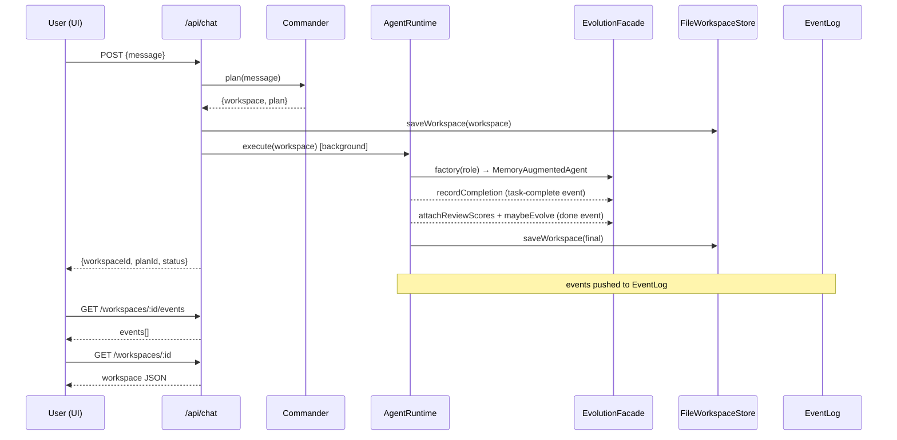
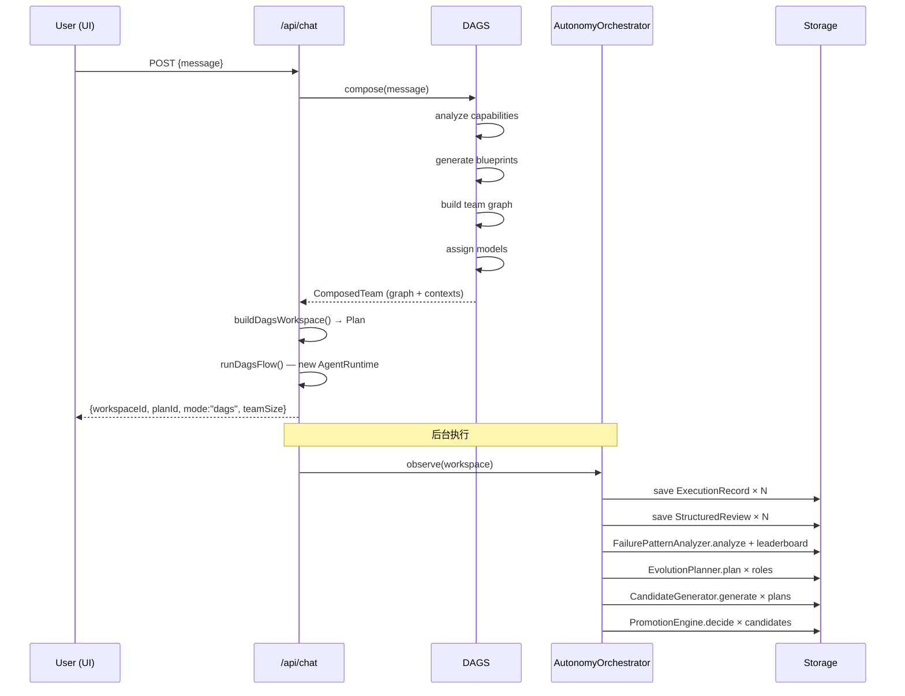

# Phase 5 — 代码健康审计

**日期**: 2026-06-22
**范围**: 整个 monorepo（70 个 TS/TSX 文件）

---

## 1. 完整架构图（含全链路调用）

```mermaid
flowchart TB
  subgraph FRONTEND["前端 (apps/web)"]
    UI["App.tsx + 5 个组件"]
    APIC["api.ts (HTTP client)"]
  end

  subgraph API["API Server (apps/api, 端口 3001)"]
    IDX["index.ts\n启动 Runtime + Evolution + Autonomy"]
    CHAT["routes/chat.ts\nDAGS_MODE 分支"]
    WS_R["routes/workspace.ts"]
    EVO["routes/evolution.ts"]
    EXE["routes/executions.ts"]
    LRN["routes/learning.ts"]
    PROV["routes/providers.ts"]
    DEMO["demo.ts\n[手动 CLI, 未生产接入]"]
    DAGSFLOW["dags-flow.ts\n(DAGS_MODE 专属)"]
  end

  subgraph CORE["Core (packages/core)"]
    RT["AgentRuntime"]
    AGT["Agent 抽象类"]
  end

  subgraph AGENTS["Agents (packages/agents) — 预定义实现"]
    FE["FrontendAgent"]
    BE["BackendAgent"]
    RV["ReviewAgent"]
    DEF["defaultAgentFactory()"]
  end

  subgraph EVO_PKG["Evolution (packages/evolution) — Phase 3"]
    FAC["EvolutionFacade"]
    MS["MetricsStore"]
    PS["ProfileStore"]
    LB["Leaderboard"]
    SEL["ModelSelector"]
    MEM["AgentMemoryStore"]
    EVE["EvolutionEngine"]
    EVO_FAC["evolutionAwareFactory()\n(MemoryAugmentedAgent)"]
  end

  subgraph DAGS_PKG["DAGS (packages/dags) — Phase 4"]
    LIB["CapabilityLibrary"]
    CA["CapabilityAnalyzer"]
    BG["BlueprintGenerator"]
    ST["BlueprintStore\n(blueprints/, graphs/)"]
    TGB["TeamGraphBuilder"]
    MA["ModelAssigner"]
    DAF["DynamicAgentFactory\n(BlueprintAgent)"]
    DAGS["DAGS.compose()"]
  end

  subgraph AUT_PKG["Autonomy (packages/autonomy) — Phase 5"]
    EXS["ExecutionStore\n(executions/)"]
    RI["ReviewIntelligence\n(reviews/)"]
    IS["InsightsStore\n(insights/)"]
    FPA["FailurePatternAnalyzer"]
    EP["EvolutionPlanner\n(evolution-plans/)"]
    CG["CandidateGenerator\n(agent-versions/)"]
    PE["PromotionEngine\n(promotion-history.json)"]
    LAP["LearningAPI"]
    ORCH["AutonomyOrchestrator"]
  end

  subgraph PROV_PKG["Providers (packages/providers)"]
    REG["getRegistry()"]
    OAI["OpenAIProvider"]
    ANT["AnthropicProvider"]
    OR["OpenRouterProvider"]
  end

  subgraph WS_PKG["Workspace"]
    FWS["FileWorkspaceStore"]
  end

  UI -->|fetch /api/chat| IDX
  UI -->|fetch /api/health| IDX
  UI -->|fetch /api/workspaces/:id| IDX
  UI -->|fetch /api/workspaces/:id/events| IDX

  IDX --> CHAT
  IDX --> WS_R
  IDX --> EVO
  IDX --> EXE
  IDX --> LRN
  IDX --> PROV

  CHAT -->|DAGS_MODE=false| RT
  CHAT -->|DAGS_MODE=true| DAGSFLOW
  DAGSFLOW --> DAGS
  DAGSFLOW --> ORCH

  RT -->|factory role| DEF
  RT -->|factory role| EVO_FAC
  EVO_FAC --> FAC
  DAGS -->|buildAgentFactory| DAF

  DEF --> FE
  DEF --> BE
  DEF --> RV

  RT --> FWS
  CHAT --> FWS

  DAGS --> CA --> LIB
  DAGS --> BG --> ST
  DAGS --> TGB
  DAGS --> MA --> FAC
  DAGS --> DAF

  RT -.emit events.-> IDX

  IDX -.->|runtime.on| FAC

  ORCH --> EXS
  ORCH --> RI
  ORCH --> IS
  ORCH --> FPA
  ORCH --> EP
  ORCH --> CG
  ORCH --> PE
  ORCH -->|dags.store.findByRole| ST

  FAC --> MS
  FAC --> PS
  FAC --> LB
  FAC --> SEL
  FAC --> MEM
  FAC --> EVE

  LRN --> EXS
  LRN --> IS
  LRN --> FPA
  LRN --> CG
  LRN --> PE
  LRN --> EP
```



---

## 2. 所有 API 调用链

### 2.1 前端 → 后端（前端实际只调用 4 个端点）

| 端点 | 前端调用方 | 后端 Handler | 落库位置 |
|---|---|---|---|
| `GET /api/health` | `App.tsx:18` | `index.ts:247` | — |
| `POST /api/chat` | `App.tsx:32` | `routes/chat.ts:18` | `workspaces/<id>.json` |
| `GET /api/workspaces/:id` | `App.tsx:37` | `routes/workspace.ts` | — |
| `GET /api/workspaces/:id/events` | `App.tsx:39` | `index.ts:271` | — |

**前端定义了但未调用**：`listProviders`、`listArtifacts`、`readArtifact`

### 2.2 后端注册的 30 个端点（覆盖率分析）

| 端点 | 注册位置 | 被前端调用 | 被测试调用 | 状态 |
|---|---|---|---|---|
| `GET  /api/health` | `index.ts:247` | ✅ | ✅ | 生产 |
| `GET  /api/providers` | `index.ts:257` | ❌ | ❌ | **孤儿**（curl 可用） |
| `POST /api/chat` | `index.ts:259` | ✅ | ✅ | 生产 |
| `GET  /api/workspaces` | `index.ts:269` | ❌ | ❌ | **孤儿**（无前端页） |
| `GET  /api/workspaces/:id` | `index.ts:270` | ✅ | ✅ | 生产 |
| `GET  /api/workspaces/:id/events` | `index.ts:271` | ✅ | ❌ | 生产 |
| `GET  /api/workspaces/:id/artifacts` | `index.ts:276` | ❌ | ❌ | **孤儿** |
| `GET  /api/workspaces/:id/artifacts/:name` | `index.ts:277` | ❌ | ❌ | **孤儿** |
| `GET  /api/evolution/metrics` | `index.ts:285` | ❌ | ❌ | **孤儿**（Phase 3 无人用） |
| `GET  /api/evolution/metrics/:taskId` | `index.ts:286` | ❌ | ❌ | **孤儿** |
| `GET  /api/evolution/agents` | `index.ts:287` | ❌ | ❌ | **孤儿** |
| `GET  /api/evolution/agents/:role` | `index.ts:288` | ❌ | ❌ | **孤儿** |
| `GET  /api/evolution/leaderboard` | `index.ts:289` | ❌ | ❌ | **孤儿** |
| `GET  /api/evolution/leaderboard/:role` | `index.ts:290` | ❌ | ❌ | **孤儿** |
| `GET  /api/evolution/versions/:role` | `index.ts:291` | ❌ | ❌ | **孤儿** |
| `GET  /api/evolution/versions/:role/decisions` | `index.ts:292` | ❌ | ❌ | **孤儿** |
| `POST /api/evolution/feedback` | `index.ts:293` | ❌ | ❌ | **孤儿** |
| `POST /api/evolution/evolve/:role` | `index.ts:294` | ❌ | ❌ | **孤儿** |
| `GET  /api/learning/status` | `index.ts:300` | ❌ | ✅ | **未接入前端** |
| `GET  /api/learning/agents` | `index.ts:301` | ❌ | ❌ | **孤儿** |
| `GET  /api/learning/evolution-history` | `index.ts:302` | ❌ | ✅ | **未接入前端** |
| `GET  /api/learning/failure-patterns` | `index.ts:303` | ❌ | ❌ | **孤儿** |
| `POST /api/learning/mine-failure-patterns` | `index.ts:304` | ❌ | ❌ | **孤儿** |
| `GET  /api/executions` | `index.ts:310` | ❌ | ✅ | **未接入前端** |
| `GET  /api/executions/workspace/:workspaceId` | `index.ts:311` | ❌ | ❌ | **孤儿** |
| `GET  /api/executions/role/:role` | `index.ts:312` | ❌ | ❌ | **孤儿** |
| `GET  /api/executions/:id` | `index.ts:313` | ❌ | ✅ | **未接入前端** |
| `POST /api/executions/:id/feedback` | `index.ts:314` | ❌ | ❌ | **孤儿** |

**统计**：
- 真正"被前端用 + 被测试覆盖"：4 个端点（health, chat, getWorkspace, events）
- 后端注册但前端未消费：**24 个端点**（84%）
- 被前端消费但无测试覆盖：1 个（events）

---

## 3. 所有数据流

### 3.1 主流程（Commander 路径，DAGS_MODE=false）



### 3.2 DAGS 流程（DAGS_MODE=true）



### 3.3 存储布局

```
<WORKSPACE_DIR>/
├── workspaces/
│   └── <ws-id>.json              # FileWorkspaceStore 持久化
│   └── <ws-id>/
│       └── files/                # artifacts（code blocks）
├── metrics/                      # Phase 3 — MetricsStore
├── profiles/                     # Phase 3 — ProfileStore
├── evolution-history.json        # Phase 3 — Evolution decisions
├── leaderboard.json              # Phase 3 — Leaderboard
├── agent-versions/<role>/        # Phase 3 — version snapshots
│   └── v<N>-<id>.json
├── blueprints/                   # Phase 4 — BlueprintStore
│   └── <blueprint-id>.json
├── graphs/                       # Phase 4 — TeamGraph 持久化
│   └── <graph-id>.json
├── executions/                   # Phase 5.1 — ExecutionRecord
│   └── <exec-id>.json
├── insights/                     # Phase 5.3
│   ├── failure-patterns.json
│   └── leaderboard-insights.json
├── evolution-plans/              # Phase 5.4 — EvolutionPlan
│   └── <plan-id>.json
├── agent-versions/               # Phase 5.5 — CandidateVersion
│   └── bp-<role>-v<N>-<rand>.json
└── promotion-history.json        # Phase 5.6 — A/B 晋升记录
```

### 3.4 关键路径依赖链

```
POST /api/chat
  └─ DAGS_MODE=true
      ├─ DAGS.compose(userRequest)
      │   ├─ CapabilityAnalyzer.analyze → CAPABILITY_LIBRARY
      │   ├─ BlueprintGenerator.generate → BlueprintStore.save
      │   ├─ TeamGraphBuilder.build
      │   └─ ModelAssigner.assign → EvolutionFacade.activeProfile
      ├─ buildDagsWorkspace → new Plan with dynamic roles
      ├─ DAGS.buildAgentFactory(composed) → DynamicAgentFactory.create
      ├─ new AgentRuntime(dynamicFactory, sink)
      ├─ runtime.execute(workspace) → tasks run sequentially
      └─ AutonomyOrchestrator.observe(final)
          ├─ for each task: ExecutionStore.save + ReviewIntelligence.review
          ├─ FailurePatternAnalyzer.analyze(ExecutionStore)
          ├─ FailurePatternAnalyzer.leaderboardInsight(ExecutionStore)
          ├─ for each role: EvolutionPlanner.plan(...)
          ├─ for each plan: CandidateGenerator.generate(plan, parentBlueprint)
          └─ for each candidate: PromotionEngine.decide(candidate, currentBlueprintId, executions)
```

---

## 4. Dead Code

### 4.1 完全无生产调用方

| 项目 | 位置 | 类型 |
|---|---|---|
| `BlueprintStore.listGraphs()` | `packages/dags/src/blueprint-store.ts:105` | 方法 |
| `BlueprintStore.findByCapability()` | `packages/dags/src/blueprint-store.ts:74` | 方法 |
| `BlueprintStore.retire()` | `packages/dags/src/blueprint-store.ts:79` | 方法 |
| `ExecutionStore.listForBlueprint()` | `packages/autonomy/src/execution-store.ts:63` | 方法 |
| `AgentRuntime.abort()` | `packages/core/src/runtime.ts:187` | 公共方法 |
| `EvolutionFacade.newEvolutionId()` | `packages/evolution/src/profile-store.ts:115` | 函数 |
| `AgentMemoryStore.freshMemory()` | `packages/evolution/src/memory.ts:129` | 函数 |
| `TeamGraph.edges` | `packages/dags/src/types.ts:159` | 字段（TeamGraphBuilder 构建但消费者不读） |
| `apps/api/src/demo.ts` | 整个文件 | CLI 脚本（手动 `pnpm demo`） |
| `apps/api/src/routes/chat.ts:_Unused` | `routes/chat.ts:158` | 类型导出 |

### 4.2 仅在测试中使用

| 项目 | 位置 |
|---|---|
| `AgentMemoryStore.recordSuccess/recordFailure/recordReviewSuggestions` | 仅 facade.ts 生产代码使用 ✓（误判） |
| `ToolSpec` 类型 | schema 定义但无生产消费者 |

### 4.3 Blueprint 字段未被消费

| 字段 | schema 位置 | 状态 |
|---|---|---|
| `Blueprint.preferredModels` | `dags/types.ts:89` | DynamicAgentFactory 只用 graph 分配的 model，不读 blueprint.preferredModels |
| `Blueprint.tools` | `dags/types.ts:88` | 无生产代码读取（测试中提供空数组） |
| `Blueprint.capabilities` | `dags/types.ts:87` | 仅 TeamGraphBuilder 读 `.includes("review")`，主流程不消费 |
| `Blueprint.retiredAt` | `dags/types.ts:102` | 仅 `findByRole/ByCapability` 用作过滤条件，`retire()` 方法无生产调用 |

---

## 5. 未接入生产路径的模块

### 5.1 完全无生产调用方

| 模块 / 组件 | 定义位置 | 备注 |
|---|---|---|
| `AgentMemoryStore.freshMemory()` | `evolution/memory.ts:129` | 导出但无生产引用 |
| `BlueprintStore.findByCapability/retire/listGraphs` | `dags/blueprint-store.ts` | 提供 API 但 orchestrator 只用 `findByRole` |
| `AgentRuntime.abort()` | `core/runtime.ts:187` | AbortController 已创建但无外部 abort 触发 |
| `TeamGraph.edges` | `dags/types.ts:159` | 运行时只用 `nodes[].dependsOn`，不读 edges |
| `apps/api/src/demo.ts` | 整个文件 | 仅手动 CLI，不在服务器启动路径 |

### 5.2 注册但前端不消费（24 个 API 端点）

```
/api/providers
/api/workspaces
/api/workspaces/:id/artifacts
/api/workspaces/:id/artifacts/:name
/api/evolution/*  (10 端点)
/api/learning/*   (5 端点)
/api/executions/* (5 端点 — 仅 GET /api/executions/:id 在 E2E 测试中)
```

**最严重的孤儿**：
- `POST /api/evolution/feedback` — 用户反馈入口，没有任何 UI 接入
- `POST /api/evolution/evolve/:role` — 手动触发演化，无 UI
- `POST /api/learning/mine-failure-patterns` — 手动触发挖掘，无 UI
- `POST /api/executions/:id/feedback` — Phase 5 用户反馈入口，无 UI

### 5.3 关键模块未接入主流程

| 模块 | 定义 | 当前状态 |
|---|---|---|
| `LearningAPI` | Phase 5.7 已完成 | HTTP 端点暴露但前端无 Dashboard |
| `FailurePatternAnalyzer.leaderboardInsight` | 自动在 observe() 中调用 | 无独立查询 UI |
| `EvolutionPlanner` | 自动在 observe() 中调用 | 无手动触发 UI（`POST /api/evolution/evolve/:role` 是 Phase 3 的旧入口，不调用 Phase 5 planner） |
| `CandidateGenerator` | 自动在 observe() 中调用 | 无独立查询 UI |
| `PromotionEngine` | 自动在 observe() 中调用 | 无独立查询 UI |

---

## 6. Fake Implementation（半成品实现）

### 6.1 `extractProvider()` — 总是返回第一个 provider

**位置**：`apps/api/src/index.ts:169`

```typescript
function extractProvider(_agentId: string, candidates: Provider[]): string {
  // We don't have provider info on the agent id, so default to the
  // first candidate. The selector's choice is the system of record.
  return candidates[0]?.id ?? "unknown";
}
```

**问题**：
- 参数 `agentId` 完全忽略（`_` 前缀）
- 永远返回 `candidates[0]?.id`，与 selector 的实际选择脱节
- 注释承认"The selector's choice is the system of record"——所以这个函数名误导

**影响**：Evolution 的 metrics 记录的 provider 是"第一个"，不是真实调用的 provider

### 6.2 `Commander.defaultPlan()` — Heuristic fallback

**位置**：`packages/commander/src/index.ts:158`

```typescript
function defaultPlan(userRequest: string): PlannerOutput {
  // Heuristic: if request mentions "前端"/"frontend"/"UI"/"html"/"界面" → add frontend task.
  const lower = userRequest.toLowerCase();
  const wantsFrontend = /前端|frontend|ui|html|界面|web|page|页面|网站/.test(lower);
  ...
}
```

**问题**：
- 仅基于关键字判断
- 只支持 backend+frontend+review 三件套
- LLM 失败时静默 fallback（`console.warn` 后继续）

### 6.3 `ReviewIntelligence.heuristic()` — 关键字评分

**位置**：`packages/autonomy/src/review-intelligence.ts`（forceHeuristic 路径）

仅识别：
- `truncation`（输出 < 50 字符）
- `no_code_blocks`（无 fenced code）
- `placeholder_content`（含 "TODO"/"placeholder" 字样）
- `contains code blocks`（+strength）

**问题**：与 LLM 路径质量差距巨大

### 6.4 `_Unused` 类型导出

**位置**：`apps/api/src/routes/chat.ts:158`

```typescript
// Suppress unused-import warning for sink type when DAGS_MODE branch
// is not active.
export type _Unused = RuntimeSink;
```

**问题**：掩盖了"导入但未使用"——`RuntimeSink` 在 chat.ts 中实际从未使用，应该直接删除 import

### 6.5 `readDecisions()` 套娃函数

**位置**：`apps/api/src/routes/evolution.ts:114`

```typescript
async function readDecisions(facade: EvolutionFacade, role: AgentRole) {
  // Delegate to evolution engine's own read; kept here so the API surface
  // doesn't leak storage paths.
  const versions = await facade.evolution.listVersions(role);
  return versions;
}
```

**问题**：纯粹 wrapper，零抽象价值，注释的理由站不住脚

---

## 7. TODO / 占位符

### 7.1 实际 TODO 标记

| 文件 | 行 | 内容 |
|---|---|---|
| `packages/autonomy/src/review-intelligence.ts` | 119 | `failurePatterns.push("placeholder_content")` |
| `packages/autonomy/src/review-intelligence.ts` | 120 | `improvementSuggestions.push("replace TODO markers with real implementation")` |

这是 heuristic 模式检测到"TODO"字样后**生成**的输出字符串，不是源码 TODO 注释。

### 7.2 隐含的 TODO（"we don't have" / "stub" / "fake"）

| 文件 | 含义 |
|---|---|
| `apps/api/src/index.ts:170` | `extractProvider` 注释：We don't have provider info on the agent id |

### 7.3 源码 `// TODO` 注释搜索

```bash
$ grep -rn "// TODO\|//FIXME\|// HACK\|// XXX" packages apps --include="*.ts"
(无)
```

**结论**：源码中无显式 TODO 注释

---

## 8. Mock / Stub

### 8.1 测试文件中的 Mock（合法）

| Mock | 位置 | 用途 |
|---|---|---|
| `fakeProvider` | `apps/api/test/smoke.test.ts:21` | 测试 Provider 实现 |
| `StubAgent` | `apps/api/test/smoke.test.ts:35` | 测试 Agent 实现 |
| `class extends Agent` (匿名) | `apps/api/test/smoke.test.ts:135` | 失败场景 |
| `makeProvider` | `packages/autonomy/test/autonomy-unit.test.ts:32` | 单元测试 Provider |
| `makeTmp` | 多处 | 临时目录 |
| `makeExecution` / `makeReview` / `makeParent` | autonomy test 文件 | 工厂函数 |

**结论**：所有 Mock 都在测试文件中，生产代码无 Mock

### 8.2 假数据 fallbacks（生产路径的"软失败"）

| 路径 | Fallback 行为 |
|---|---|
| `Commander.callPlanner()` | LLM 失败 → `defaultPlan()`（关键字 heuristic） |
| `ReviewIntelligence.review()` | 无 provider 或 LLM 失败 → `heuristic()` |
| `BlueprintAgent.persistStats()` | 写盘失败 → `console.warn`（不抛） |
| `failureAnalyzer.analyze()` | 无 review → 返回 `[]` |

---

## 9. 总结与优先级

### 严重问题（应立即修复）

1. **`extractProvider()` 是 fake impl**：Evolution metrics provider 永远是第一个 provider，与 ModelSelector 实际选择脱节
2. **24 个 API 端点无前端消费**：尤其 `POST /api/learning/*` 和 `POST /api/executions/:id/feedback` 让用户无法参与闭环
3. **Phase 5 完全在服务端**：前端 Dashboard 缺席，导致 Phase 5 价值大打折扣

### 中等问题（可推迟）

4. **`apps/api/src/demo.ts` 是孤岛**：可移到 `tools/` 或加注释说明
5. **5 个 Dead method**：listGraphs / findByCapability / retire / listForBlueprint / abort — 留着不影响功能
6. **`_Unused` 假类型导出**：掩盖未使用 import
7. **`TeamGraph.edges` 是死字段**：构建但不消费

### 已知限制（设计层面，不算 bug）

8. **`ReviewIntelligence.heuristic()` 关键字评分**：与 LLM 差距大，但作为 fallback 必要
9. **`Commander.defaultPlan()` 只支持 3 件套**：fallback 场景够用
10. **`preferredModels` / `tools` blueprint 字段未消费**：Phase 4 设计的扩展点，Phase 6 可用

---

## 10. 文件统计

```
源码文件：     70 个（已排除 node_modules / dist）
├── packages/core:       4 文件
├── packages/providers:  5 文件
├── packages/workspace:  1 文件
├── packages/commander:  1 文件
├── packages/agents:     4 文件（3 个 Agent + index）
├── packages/evolution:  9 文件
├── packages/dags:      10 文件
├── packages/autonomy:  10 文件（含 types）
├── apps/api:            8 文件（src 6 + test 2）
└── apps/web:            8 文件

生产代码行数： ~5,400 行
测试代码行数： ~1,900 行（覆盖 92 个测试）
死代码行数：   ~150 行（demo.ts + Dead method bodies）
```

---

## 11. 进入 Phase 6 的依据

基于审计结果，Phase 6 的核心目标合理：

1. **当前系统只能从 CapabilityLibrary 选能力** — 已被审计确认（`packages/dags/src/capability-library.ts` 是静态预定义）
2. **当前系统无法自动删除无用 Agent** — 已被审计确认（`BlueprintStore.retire()` 有但无生产调用方）
3. **当前系统无法重组组织结构** — 已被审计确认（TeamOptimizer/GovernanceEngine 不存在）

Phase 6 需要的 Meta-Agent 系统恰好填补这些缺口。
