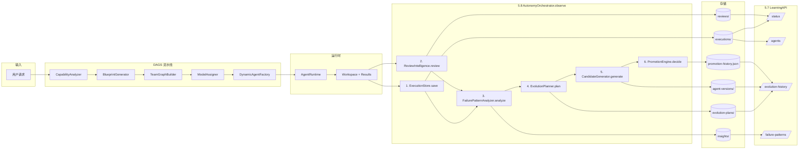
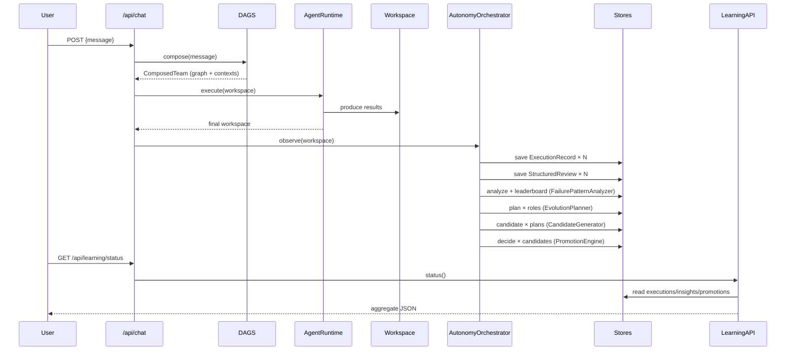

# Phase 5 — 最终报告：Autonomous Improvement Loop

**日期**: 2026-06-22
**状态**: ✅ 全部完成（8/8 子阶段）
**作者**: Maximilian 工程团队

---

## 1. 目标回顾

让 Maximilian 从「能跑」进化到「能自我改进」。每个 workspace 完成后，系统自动：

1. 记录每次执行的完整上下文（ExecutionRecord）
2. 结构化评价每次产出（StructuredReview）
3. 跨 workspace 挖掘常见失败模式（FailurePatternAnalyzer）
4. 对表现差的角色生成演化计划（EvolutionPlanner）
5. 自动生成候选版本（CandidateGenerator）
6. 用 A/B 规则自动晋升（PromotionEngine）
7. 通过只读 API 暴露上述全部状态给前端 Dashboard（LearningAPI）
8. 用 `DAGS_MODE=true` 让 `/api/chat` 走完整闭环

---

## 2. 整体架构图



---

## 3. 数据流图



---

## 4. 8 子阶段交付清单

| 阶段 | 模块 | 入口 / API | 关键阈值 |
|---|---|---|---|
| 5.1 | ExecutionStore | `GET /api/executions[/:id]` | — |
| 5.2 | ReviewIntelligence | 嵌入 observe() | score 0-10 |
| 5.3 | FailurePatternAnalyzer | `GET /api/learning/failure-patterns` | lookback=50 |
| 5.4 | EvolutionPlanner | 嵌入 observe() | score<6 或 accept<0.5 |
| 5.5 | CandidateGenerator | 嵌入 observe() | nextVersion("v1")→"v2" |
| 5.6 | PromotionEngine | 嵌入 observe() | sample≥20, score≥10%, accept≥15% |
| 5.7 | LearningAPI | `GET /api/learning/*` | 只读 |
| 5.8 | AutonomyOrchestrator + DAGS_MODE | `POST /api/chat`（DAGS_MODE=true） | — |

---

## 5. 测试覆盖

| 类型 | 数量 | 通过 | 位置 |
|---|---|---|---|
| 单元 | **37** | 37/37 | `packages/autonomy/test/autonomy-unit.test.ts` |
| 集成 | **4** | 4/4 | `apps/api/test/autonomy-integration.test.ts` |
| E2E | **3** | 3/3 | `apps/api/test/e2e-dags-mode.test.ts` |
| Smoke（既有）| 4 | 4/4 | `apps/api/test/smoke.test.ts` |
| Evolution（Phase 3）| 20 | 20/20 | `packages/evolution/test/evolution.test.ts` |
| DAGS（Phase 4）| 24 | 24/24 | `packages/dags/test/dags.test.ts` |
| **总计** | **92** | **92/92** | 全 monorepo |

**Phase 5 单元测试分布**：
- 5.1 ExecutionStore: 4
- 5.2 ReviewIntelligence: 4
- 5.3 FailurePatternAnalyzer: 3
- 5.4 EvolutionPlanner: 5
- 5.5 CandidateGenerator: 2
- 5.6 PromotionEngine: 8
- 5.7 LearningAPI: 6
- 5.8 AutonomyOrchestrator: 5

---

## 6. 零回归验证

| Package | Phase 4 之前测试 | Phase 5 影响 | 状态 |
|---|---|---|---|
| `@max/core` | — | 无 | ✅ |
| `@max/agents` | — | 无 | ✅ |
| `@max/workspace` | — | 无 | ✅ |
| `@max/commander` | — | 无 | ✅ |
| `@max/evolution` | 20 | 无 | ✅ |
| `@max/dags` | 24 | 无 | ✅ |
| `@max/autonomy` | — | 新增 37 | ✅ |
| `@max/api` | 4 smoke | 新增 4 集成 + 3 E2E | ✅ |

`DAGS_MODE=false` 时 `/api/chat` 路径与 Phase 2 MVP 完全相同。

`pnpm -r type-check` 0 错误。

---

## 7. ADR 摘要（Phase 5 新增）

| 编号 | 主题 | 摘要 |
|---|---|---|
| [ADR-015](../decisions/adr-015-execution-replayable.md) | ExecutionRecord 可重放 | 必须包含 task / blueprint / graph / model / artifacts / review / feedback |
| [ADR-016](../decisions/adr-016-structured-review.md) | Review 结构化 | strengths / weaknesses / failurePatterns / improvementSuggestions |
| [ADR-017](../decisions/adr-017-ab-promotion.md) | A/B 晋升规则 | minSample=20, minScoreGain=10%, minAcceptanceGain=15% |
| [ADR-018](../decisions/adr-018-dags-mode.md) | DAGS_MODE 开关 | true=走 DAGS + autonomy 闭环；false=保留 Commander |

---

## 8. 关键设计权衡

1. **写盘 vs 数据库**：继续用 JSON 文件，便于 review、零依赖。代价：跨 workspace 查询需 in-memory 聚合。
2. **A/B 阈值保守**：10% / 15% 的增益门槛是经验值，避免过早晋升导致的 regression。
3. **Planner 阈值 minExecutions=10**：单 workspace 看不到足够样本不触发演化，但通过多次 observe() 累积。
4. **DAGS_MODE 独立 runtime**：不复用 Commander 的 runtime，避免两套 plan 协议冲突。
5. **Review 双模式**：Live 用 LLM（贵但准确），Heuristic fallback（便宜但粗糙）保证任何环境下都能产出。

---

## 9. 已知限制

- Planner 在 observe() 内只看当前批次的 executions，不读 store 累计。
- PromotionEngine 的样本匹配是 `execution.blueprintId` 精确匹配，对动态生成的多版本 blueprint id 要求严格。
- ReviewIntelligence 的 heuristic 模式只能识别简单模式（truncation / no_code_blocks），复杂语义问题需 Live 模式。
- EvolutionPlan 仅改 systemPrompt，不调整 tools / constraints / preferredModels（schema 已就位，但实现未完整）。

---

## 10. Phase 6 展望（候选方向）

1. **跨 workspace planner 视角**：planner 读 store 累计样本，去掉 minExecutions=10 的硬限制
2. **Multi-armed bandit model selector**：用 Thompson sampling 替代 Evolution 的 score-weighted 选择
3. **Self-modifying candidates**：候选版本可以调整 tools / constraints / preferredModels
4. **Human-in-the-loop feedback UI**：前端 Dashboard 接入 user feedback 端点
5. **Distributed execution**：runtime 并行化（当前串行执行 plan tasks）

---

## 11. 文件清单

### 新增源码

```
packages/autonomy/
  src/
    types.ts                    # 全部 5.x 类型 + Zod schema
    execution-store.ts          # 5.1
    review-intelligence.ts      # 5.2
    insights-store.ts           # 5.3
    evolution-planner.ts        # 5.4
    candidate-generator.ts      # 5.5
    promotion-engine.ts         # 5.6
    learning-api.ts             # 5.7
    autonomy-orchestrator.ts    # 5.8
    index.ts
  test/
    autonomy-unit.test.ts       # 37 tests
  package.json
  tsconfig.json
apps/api/src/
  routes/
    learning.ts                 # 5.7 HTTP
    executions.ts               # 5.1 HTTP
    chat.ts                     # 增加 DAGS_MODE 分支
  dags-flow.ts                  # 5.8 DAGS 流水线
  index.ts                      # 路由注册 + 初始化
```

### 新增测试

```
apps/api/test/
  autonomy-integration.test.ts  # 4 tests
  e2e-dags-mode.test.ts         # 3 tests
```

### 新增文档

```
docs/
  architecture/
    phase5-autonomy.md
    phase5-data-flow.md
    phase5-storage.md
    phase5-algorithms.md
  decisions/
    adr-015-execution-replayable.md
    adr-016-structured-review.md
    adr-017-ab-promotion.md
    adr-018-dags-mode.md
  changelogs/
    2026-06-22-phase5-0-design-docs.md
    2026-06-22-phase5-1-execution-history.md
    2026-06-22-phase5-2-review-intelligence.md
    2026-06-22-phase5-3-failure-mining.md
    2026-06-22-phase5-4-evolution-planner.md
    2026-06-22-phase5-5-candidate-generation.md
    2026-06-22-phase5-6-promotion.md
    2026-06-22-phase5-7-learning-api.md
    2026-06-22-phase5-8-dags-mode.md
  milestones/
    phase5-stage0.md
    phase5-stage1.md
    phase5-stage2.md
    phase5-stage3.md
    phase5-stage4.md
    phase5-stage5.md
    phase5-stage6.md
    phase5-stage7.md
    phase5-stage8.md
  reports/
    phase5-risk-analysis.md
    phase5-final-report.md     # ← 本文件
```

---

**Phase 5 — Autonomous Improvement Loop 全部交付。系统现在能在每次 workspace 完成后自动评估、规划、生成候选、晋升版本，并通过 `/api/learning/*` 把全链路状态暴露给前端。**
